Complete Data Analysis Workflow in R
================
By Muhammad Yasir Qurashi
2026-03-16

## **Step 01**

> Defining Research Question

Investigate morphological variation among penguin species and examine
relationships between body size measurements, and answer the following
queries;

- Do penguin species differ in body mass?

- Is flipper length associated with body mass?

- Are there morphological differences between male and female penguins?

## **Step 02**

> Load Require Libraries

``` r
# Keep remember first install these libraries in your console and then activate using library command

library(tidyverse)
```

    ## ── Attaching core tidyverse packages ──────────────────────── tidyverse 2.0.0 ──
    ## ✔ dplyr     1.2.0     ✔ readr     2.1.5
    ## ✔ forcats   1.0.1     ✔ stringr   1.5.2
    ## ✔ ggplot2   4.0.2     ✔ tibble    3.3.0
    ## ✔ lubridate 1.9.4     ✔ tidyr     1.3.1
    ## ✔ purrr     1.1.0     
    ## ── Conflicts ────────────────────────────────────────── tidyverse_conflicts() ──
    ## ✖ dplyr::filter() masks stats::filter()
    ## ✖ dplyr::lag()    masks stats::lag()
    ## ℹ Use the conflicted package (<http://conflicted.r-lib.org/>) to force all conflicts to become errors

``` r
library(palmerpenguins)
```

    ## 
    ## Attaching package: 'palmerpenguins'
    ## 
    ## The following objects are masked from 'package:datasets':
    ## 
    ##     penguins, penguins_raw

``` r
library(naniar)
library(patchwork)
library(GGally)
library(janitor)
```

    ## 
    ## Attaching package: 'janitor'
    ## 
    ## The following objects are masked from 'package:stats':
    ## 
    ##     chisq.test, fisher.test

``` r
library(skimr)
```

    ## 
    ## Attaching package: 'skimr'
    ## 
    ## The following object is masked from 'package:naniar':
    ## 
    ##     n_complete

``` r
library(rstatix)
```

    ## 
    ## Attaching package: 'rstatix'
    ## 
    ## The following object is masked from 'package:janitor':
    ## 
    ##     make_clean_names
    ## 
    ## The following object is masked from 'package:stats':
    ## 
    ##     filter

| Package   | Role                       |
|-----------|----------------------------|
| tidyverse | data manipulation          |
| janitor   | clean column names         |
| skimr     | dataset summary            |
| naniar    | missing data visualization |
| GGally    | correlation plots          |
| patchwork | combine figures            |
| rstatix   | check outliers in once     |

## **Step 03**

> Load dataset

``` r
penguin_data <- penguins
print(penguin_data)
```

    ## # A tibble: 344 × 8
    ##    species island    bill_length_mm bill_depth_mm flipper_length_mm body_mass_g
    ##    <fct>   <fct>              <dbl>         <dbl>             <int>       <int>
    ##  1 Adelie  Torgersen           39.1          18.7               181        3750
    ##  2 Adelie  Torgersen           39.5          17.4               186        3800
    ##  3 Adelie  Torgersen           40.3          18                 195        3250
    ##  4 Adelie  Torgersen           NA            NA                  NA          NA
    ##  5 Adelie  Torgersen           36.7          19.3               193        3450
    ##  6 Adelie  Torgersen           39.3          20.6               190        3650
    ##  7 Adelie  Torgersen           38.9          17.8               181        3625
    ##  8 Adelie  Torgersen           39.2          19.6               195        4675
    ##  9 Adelie  Torgersen           34.1          18.1               193        3475
    ## 10 Adelie  Torgersen           42            20.2               190        4250
    ## # ℹ 334 more rows
    ## # ℹ 2 more variables: sex <fct>, year <int>

## **Step 04**

> Understanding your data

``` r
dim(penguin_data)
```

    ## [1] 344   8

``` r
nrow(penguin_data)
```

    ## [1] 344

``` r
ncol(penguin_data)
```

    ## [1] 8

``` r
colnames(penguin_data)
```

    ## [1] "species"           "island"            "bill_length_mm"   
    ## [4] "bill_depth_mm"     "flipper_length_mm" "body_mass_g"      
    ## [7] "sex"               "year"

``` r
head(penguin_data)
```

    ## # A tibble: 6 × 8
    ##   species island    bill_length_mm bill_depth_mm flipper_length_mm body_mass_g
    ##   <fct>   <fct>              <dbl>         <dbl>             <int>       <int>
    ## 1 Adelie  Torgersen           39.1          18.7               181        3750
    ## 2 Adelie  Torgersen           39.5          17.4               186        3800
    ## 3 Adelie  Torgersen           40.3          18                 195        3250
    ## 4 Adelie  Torgersen           NA            NA                  NA          NA
    ## 5 Adelie  Torgersen           36.7          19.3               193        3450
    ## 6 Adelie  Torgersen           39.3          20.6               190        3650
    ## # ℹ 2 more variables: sex <fct>, year <int>

``` r
str(penguin_data)
```

    ## tibble [344 × 8] (S3: tbl_df/tbl/data.frame)
    ##  $ species          : Factor w/ 3 levels "Adelie","Chinstrap",..: 1 1 1 1 1 1 1 1 1 1 ...
    ##  $ island           : Factor w/ 3 levels "Biscoe","Dream",..: 3 3 3 3 3 3 3 3 3 3 ...
    ##  $ bill_length_mm   : num [1:344] 39.1 39.5 40.3 NA 36.7 39.3 38.9 39.2 34.1 42 ...
    ##  $ bill_depth_mm    : num [1:344] 18.7 17.4 18 NA 19.3 20.6 17.8 19.6 18.1 20.2 ...
    ##  $ flipper_length_mm: int [1:344] 181 186 195 NA 193 190 181 195 193 190 ...
    ##  $ body_mass_g      : int [1:344] 3750 3800 3250 NA 3450 3650 3625 4675 3475 4250 ...
    ##  $ sex              : Factor w/ 2 levels "female","male": 2 1 1 NA 1 2 1 2 NA NA ...
    ##  $ year             : int [1:344] 2007 2007 2007 2007 2007 2007 2007 2007 2007 2007 ...

``` r
glimpse(penguin_data)
```

    ## Rows: 344
    ## Columns: 8
    ## $ species           <fct> Adelie, Adelie, Adelie, Adelie, Adelie, Adelie, Adel…
    ## $ island            <fct> Torgersen, Torgersen, Torgersen, Torgersen, Torgerse…
    ## $ bill_length_mm    <dbl> 39.1, 39.5, 40.3, NA, 36.7, 39.3, 38.9, 39.2, 34.1, …
    ## $ bill_depth_mm     <dbl> 18.7, 17.4, 18.0, NA, 19.3, 20.6, 17.8, 19.6, 18.1, …
    ## $ flipper_length_mm <int> 181, 186, 195, NA, 193, 190, 181, 195, 193, 190, 186…
    ## $ body_mass_g       <int> 3750, 3800, 3250, NA, 3450, 3650, 3625, 4675, 3475, …
    ## $ sex               <fct> male, female, female, NA, female, male, female, male…
    ## $ year              <int> 2007, 2007, 2007, 2007, 2007, 2007, 2007, 2007, 2007…

``` r
tail(penguin_data)
```

    ## # A tibble: 6 × 8
    ##   species   island bill_length_mm bill_depth_mm flipper_length_mm body_mass_g
    ##   <fct>     <fct>           <dbl>         <dbl>             <int>       <int>
    ## 1 Chinstrap Dream            45.7          17                 195        3650
    ## 2 Chinstrap Dream            55.8          19.8               207        4000
    ## 3 Chinstrap Dream            43.5          18.1               202        3400
    ## 4 Chinstrap Dream            49.6          18.2               193        3775
    ## 5 Chinstrap Dream            50.8          19                 210        4100
    ## 6 Chinstrap Dream            50.2          18.7               198        3775
    ## # ℹ 2 more variables: sex <fct>, year <int>

``` r
slice_sample(penguin_data)
```

    ## # A tibble: 1 × 8
    ##   species   island bill_length_mm bill_depth_mm flipper_length_mm body_mass_g
    ##   <fct>     <fct>           <dbl>         <dbl>             <int>       <int>
    ## 1 Chinstrap Dream            48.1          16.4               199        3325
    ## # ℹ 2 more variables: sex <fct>, year <int>

``` r
summary(penguin_data)
```

    ##       species          island    bill_length_mm  bill_depth_mm  
    ##  Adelie   :152   Biscoe   :168   Min.   :32.10   Min.   :13.10  
    ##  Chinstrap: 68   Dream    :124   1st Qu.:39.23   1st Qu.:15.60  
    ##  Gentoo   :124   Torgersen: 52   Median :44.45   Median :17.30  
    ##                                  Mean   :43.92   Mean   :17.15  
    ##                                  3rd Qu.:48.50   3rd Qu.:18.70  
    ##                                  Max.   :59.60   Max.   :21.50  
    ##                                  NA's   :2       NA's   :2      
    ##  flipper_length_mm  body_mass_g       sex           year     
    ##  Min.   :172.0     Min.   :2700   female:165   Min.   :2007  
    ##  1st Qu.:190.0     1st Qu.:3550   male  :168   1st Qu.:2007  
    ##  Median :197.0     Median :4050   NA's  : 11   Median :2008  
    ##  Mean   :200.9     Mean   :4202                Mean   :2008  
    ##  3rd Qu.:213.0     3rd Qu.:4750                3rd Qu.:2009  
    ##  Max.   :231.0     Max.   :6300                Max.   :2009  
    ##  NA's   :2         NA's   :2

| Variable          | Type        |
|-------------------|-------------|
| species           | categorical |
| island            | categorical |
| bill_length_mm    | numeric     |
| bill_depth_mm     | numeric     |
| flipper_length_mm | numeric     |
| body_mass_g       | numeric     |
| sex               | categorical |
| year              | numeric     |

- No of rows(observation); 344
- No of columns(variables); 8

## **Step 05**

> Data Quality assessment

``` r
# 1. Check duplicates

duplicated(penguin_data)
```

    ##   [1] FALSE FALSE FALSE FALSE FALSE FALSE FALSE FALSE FALSE FALSE FALSE FALSE
    ##  [13] FALSE FALSE FALSE FALSE FALSE FALSE FALSE FALSE FALSE FALSE FALSE FALSE
    ##  [25] FALSE FALSE FALSE FALSE FALSE FALSE FALSE FALSE FALSE FALSE FALSE FALSE
    ##  [37] FALSE FALSE FALSE FALSE FALSE FALSE FALSE FALSE FALSE FALSE FALSE FALSE
    ##  [49] FALSE FALSE FALSE FALSE FALSE FALSE FALSE FALSE FALSE FALSE FALSE FALSE
    ##  [61] FALSE FALSE FALSE FALSE FALSE FALSE FALSE FALSE FALSE FALSE FALSE FALSE
    ##  [73] FALSE FALSE FALSE FALSE FALSE FALSE FALSE FALSE FALSE FALSE FALSE FALSE
    ##  [85] FALSE FALSE FALSE FALSE FALSE FALSE FALSE FALSE FALSE FALSE FALSE FALSE
    ##  [97] FALSE FALSE FALSE FALSE FALSE FALSE FALSE FALSE FALSE FALSE FALSE FALSE
    ## [109] FALSE FALSE FALSE FALSE FALSE FALSE FALSE FALSE FALSE FALSE FALSE FALSE
    ## [121] FALSE FALSE FALSE FALSE FALSE FALSE FALSE FALSE FALSE FALSE FALSE FALSE
    ## [133] FALSE FALSE FALSE FALSE FALSE FALSE FALSE FALSE FALSE FALSE FALSE FALSE
    ## [145] FALSE FALSE FALSE FALSE FALSE FALSE FALSE FALSE FALSE FALSE FALSE FALSE
    ## [157] FALSE FALSE FALSE FALSE FALSE FALSE FALSE FALSE FALSE FALSE FALSE FALSE
    ## [169] FALSE FALSE FALSE FALSE FALSE FALSE FALSE FALSE FALSE FALSE FALSE FALSE
    ## [181] FALSE FALSE FALSE FALSE FALSE FALSE FALSE FALSE FALSE FALSE FALSE FALSE
    ## [193] FALSE FALSE FALSE FALSE FALSE FALSE FALSE FALSE FALSE FALSE FALSE FALSE
    ## [205] FALSE FALSE FALSE FALSE FALSE FALSE FALSE FALSE FALSE FALSE FALSE FALSE
    ## [217] FALSE FALSE FALSE FALSE FALSE FALSE FALSE FALSE FALSE FALSE FALSE FALSE
    ## [229] FALSE FALSE FALSE FALSE FALSE FALSE FALSE FALSE FALSE FALSE FALSE FALSE
    ## [241] FALSE FALSE FALSE FALSE FALSE FALSE FALSE FALSE FALSE FALSE FALSE FALSE
    ## [253] FALSE FALSE FALSE FALSE FALSE FALSE FALSE FALSE FALSE FALSE FALSE FALSE
    ## [265] FALSE FALSE FALSE FALSE FALSE FALSE FALSE FALSE FALSE FALSE FALSE FALSE
    ## [277] FALSE FALSE FALSE FALSE FALSE FALSE FALSE FALSE FALSE FALSE FALSE FALSE
    ## [289] FALSE FALSE FALSE FALSE FALSE FALSE FALSE FALSE FALSE FALSE FALSE FALSE
    ## [301] FALSE FALSE FALSE FALSE FALSE FALSE FALSE FALSE FALSE FALSE FALSE FALSE
    ## [313] FALSE FALSE FALSE FALSE FALSE FALSE FALSE FALSE FALSE FALSE FALSE FALSE
    ## [325] FALSE FALSE FALSE FALSE FALSE FALSE FALSE FALSE FALSE FALSE FALSE FALSE
    ## [337] FALSE FALSE FALSE FALSE FALSE FALSE FALSE FALSE

``` r
sum(duplicated(penguin_data))
```

    ## [1] 0

``` r
## No duplicate values detected

# 2. Summary statistics to check unusual values

skim(penguin_data)
```

|                                                  |              |
|:-------------------------------------------------|:-------------|
| Name                                             | penguin_data |
| Number of rows                                   | 344          |
| Number of columns                                | 8            |
| \_\_\_\_\_\_\_\_\_\_\_\_\_\_\_\_\_\_\_\_\_\_\_   |              |
| Column type frequency:                           |              |
| factor                                           | 3            |
| numeric                                          | 5            |
| \_\_\_\_\_\_\_\_\_\_\_\_\_\_\_\_\_\_\_\_\_\_\_\_ |              |
| Group variables                                  | None         |

Data summary

**Variable type: factor**

| skim_variable | n_missing | complete_rate | ordered | n_unique | top_counts |
|:---|---:|---:|:---|---:|:---|
| species | 0 | 1.00 | FALSE | 3 | Ade: 152, Gen: 124, Chi: 68 |
| island | 0 | 1.00 | FALSE | 3 | Bis: 168, Dre: 124, Tor: 52 |
| sex | 11 | 0.97 | FALSE | 2 | mal: 168, fem: 165 |

**Variable type: numeric**

| skim_variable | n_missing | complete_rate | mean | sd | p0 | p25 | p50 | p75 | p100 | hist |
|:---|---:|---:|---:|---:|---:|---:|---:|---:|---:|:---|
| bill_length_mm | 2 | 0.99 | 43.92 | 5.46 | 32.1 | 39.23 | 44.45 | 48.5 | 59.6 | ▃▇▇▆▁ |
| bill_depth_mm | 2 | 0.99 | 17.15 | 1.97 | 13.1 | 15.60 | 17.30 | 18.7 | 21.5 | ▅▅▇▇▂ |
| flipper_length_mm | 2 | 0.99 | 200.92 | 14.06 | 172.0 | 190.00 | 197.00 | 213.0 | 231.0 | ▂▇▃▅▂ |
| body_mass_g | 2 | 0.99 | 4201.75 | 801.95 | 2700.0 | 3550.00 | 4050.00 | 4750.0 | 6300.0 | ▃▇▆▃▂ |
| year | 0 | 1.00 | 2008.03 | 0.82 | 2007.0 | 2007.00 | 2008.00 | 2009.0 | 2009.0 | ▇▁▇▁▇ |

## **Step 06**

> Data Cleaning

``` r
# 1. Standardize column names
penguin_data <- penguin_data %>% clean_names() 
 colnames(penguin_data)
```

    ## [1] "species"           "island"            "bill_length_mm"   
    ## [4] "bill_depth_mm"     "flipper_length_mm" "body_mass_g"      
    ## [7] "sex"               "year"

``` r
glimpse(penguin_data)
```

    ## Rows: 344
    ## Columns: 8
    ## $ species           <fct> Adelie, Adelie, Adelie, Adelie, Adelie, Adelie, Adel…
    ## $ island            <fct> Torgersen, Torgersen, Torgersen, Torgersen, Torgerse…
    ## $ bill_length_mm    <dbl> 39.1, 39.5, 40.3, NA, 36.7, 39.3, 38.9, 39.2, 34.1, …
    ## $ bill_depth_mm     <dbl> 18.7, 17.4, 18.0, NA, 19.3, 20.6, 17.8, 19.6, 18.1, …
    ## $ flipper_length_mm <int> 181, 186, 195, NA, 193, 190, 181, 195, 193, 190, 186…
    ## $ body_mass_g       <int> 3750, 3800, 3250, NA, 3450, 3650, 3625, 4675, 3475, …
    ## $ sex               <fct> male, female, female, NA, female, male, female, male…
    ## $ year              <int> 2007, 2007, 2007, 2007, 2007, 2007, 2007, 2007, 2007…

## **Step 07**

> Handling missing values

``` r
# 1. Checking for missing values in each column

is.na.data.frame(penguin_data)
```

    ##        species island bill_length_mm bill_depth_mm flipper_length_mm
    ##   [1,]   FALSE  FALSE          FALSE         FALSE             FALSE
    ##   [2,]   FALSE  FALSE          FALSE         FALSE             FALSE
    ##   [3,]   FALSE  FALSE          FALSE         FALSE             FALSE
    ##   [4,]   FALSE  FALSE           TRUE          TRUE              TRUE
    ##   [5,]   FALSE  FALSE          FALSE         FALSE             FALSE
    ##   [6,]   FALSE  FALSE          FALSE         FALSE             FALSE
    ##   [7,]   FALSE  FALSE          FALSE         FALSE             FALSE
    ##   [8,]   FALSE  FALSE          FALSE         FALSE             FALSE
    ##   [9,]   FALSE  FALSE          FALSE         FALSE             FALSE
    ##  [10,]   FALSE  FALSE          FALSE         FALSE             FALSE
    ##  [11,]   FALSE  FALSE          FALSE         FALSE             FALSE
    ##  [12,]   FALSE  FALSE          FALSE         FALSE             FALSE
    ##  [13,]   FALSE  FALSE          FALSE         FALSE             FALSE
    ##  [14,]   FALSE  FALSE          FALSE         FALSE             FALSE
    ##  [15,]   FALSE  FALSE          FALSE         FALSE             FALSE
    ##  [16,]   FALSE  FALSE          FALSE         FALSE             FALSE
    ##  [17,]   FALSE  FALSE          FALSE         FALSE             FALSE
    ##  [18,]   FALSE  FALSE          FALSE         FALSE             FALSE
    ##  [19,]   FALSE  FALSE          FALSE         FALSE             FALSE
    ##  [20,]   FALSE  FALSE          FALSE         FALSE             FALSE
    ##  [21,]   FALSE  FALSE          FALSE         FALSE             FALSE
    ##  [22,]   FALSE  FALSE          FALSE         FALSE             FALSE
    ##  [23,]   FALSE  FALSE          FALSE         FALSE             FALSE
    ##  [24,]   FALSE  FALSE          FALSE         FALSE             FALSE
    ##  [25,]   FALSE  FALSE          FALSE         FALSE             FALSE
    ##  [26,]   FALSE  FALSE          FALSE         FALSE             FALSE
    ##  [27,]   FALSE  FALSE          FALSE         FALSE             FALSE
    ##  [28,]   FALSE  FALSE          FALSE         FALSE             FALSE
    ##  [29,]   FALSE  FALSE          FALSE         FALSE             FALSE
    ##  [30,]   FALSE  FALSE          FALSE         FALSE             FALSE
    ##  [31,]   FALSE  FALSE          FALSE         FALSE             FALSE
    ##  [32,]   FALSE  FALSE          FALSE         FALSE             FALSE
    ##  [33,]   FALSE  FALSE          FALSE         FALSE             FALSE
    ##  [34,]   FALSE  FALSE          FALSE         FALSE             FALSE
    ##  [35,]   FALSE  FALSE          FALSE         FALSE             FALSE
    ##  [36,]   FALSE  FALSE          FALSE         FALSE             FALSE
    ##  [37,]   FALSE  FALSE          FALSE         FALSE             FALSE
    ##  [38,]   FALSE  FALSE          FALSE         FALSE             FALSE
    ##  [39,]   FALSE  FALSE          FALSE         FALSE             FALSE
    ##  [40,]   FALSE  FALSE          FALSE         FALSE             FALSE
    ##  [41,]   FALSE  FALSE          FALSE         FALSE             FALSE
    ##  [42,]   FALSE  FALSE          FALSE         FALSE             FALSE
    ##  [43,]   FALSE  FALSE          FALSE         FALSE             FALSE
    ##  [44,]   FALSE  FALSE          FALSE         FALSE             FALSE
    ##  [45,]   FALSE  FALSE          FALSE         FALSE             FALSE
    ##  [46,]   FALSE  FALSE          FALSE         FALSE             FALSE
    ##  [47,]   FALSE  FALSE          FALSE         FALSE             FALSE
    ##  [48,]   FALSE  FALSE          FALSE         FALSE             FALSE
    ##  [49,]   FALSE  FALSE          FALSE         FALSE             FALSE
    ##  [50,]   FALSE  FALSE          FALSE         FALSE             FALSE
    ##  [51,]   FALSE  FALSE          FALSE         FALSE             FALSE
    ##  [52,]   FALSE  FALSE          FALSE         FALSE             FALSE
    ##  [53,]   FALSE  FALSE          FALSE         FALSE             FALSE
    ##  [54,]   FALSE  FALSE          FALSE         FALSE             FALSE
    ##  [55,]   FALSE  FALSE          FALSE         FALSE             FALSE
    ##  [56,]   FALSE  FALSE          FALSE         FALSE             FALSE
    ##  [57,]   FALSE  FALSE          FALSE         FALSE             FALSE
    ##  [58,]   FALSE  FALSE          FALSE         FALSE             FALSE
    ##  [59,]   FALSE  FALSE          FALSE         FALSE             FALSE
    ##  [60,]   FALSE  FALSE          FALSE         FALSE             FALSE
    ##  [61,]   FALSE  FALSE          FALSE         FALSE             FALSE
    ##  [62,]   FALSE  FALSE          FALSE         FALSE             FALSE
    ##  [63,]   FALSE  FALSE          FALSE         FALSE             FALSE
    ##  [64,]   FALSE  FALSE          FALSE         FALSE             FALSE
    ##  [65,]   FALSE  FALSE          FALSE         FALSE             FALSE
    ##  [66,]   FALSE  FALSE          FALSE         FALSE             FALSE
    ##  [67,]   FALSE  FALSE          FALSE         FALSE             FALSE
    ##  [68,]   FALSE  FALSE          FALSE         FALSE             FALSE
    ##  [69,]   FALSE  FALSE          FALSE         FALSE             FALSE
    ##  [70,]   FALSE  FALSE          FALSE         FALSE             FALSE
    ##  [71,]   FALSE  FALSE          FALSE         FALSE             FALSE
    ##  [72,]   FALSE  FALSE          FALSE         FALSE             FALSE
    ##  [73,]   FALSE  FALSE          FALSE         FALSE             FALSE
    ##  [74,]   FALSE  FALSE          FALSE         FALSE             FALSE
    ##  [75,]   FALSE  FALSE          FALSE         FALSE             FALSE
    ##  [76,]   FALSE  FALSE          FALSE         FALSE             FALSE
    ##  [77,]   FALSE  FALSE          FALSE         FALSE             FALSE
    ##  [78,]   FALSE  FALSE          FALSE         FALSE             FALSE
    ##  [79,]   FALSE  FALSE          FALSE         FALSE             FALSE
    ##  [80,]   FALSE  FALSE          FALSE         FALSE             FALSE
    ##  [81,]   FALSE  FALSE          FALSE         FALSE             FALSE
    ##  [82,]   FALSE  FALSE          FALSE         FALSE             FALSE
    ##  [83,]   FALSE  FALSE          FALSE         FALSE             FALSE
    ##  [84,]   FALSE  FALSE          FALSE         FALSE             FALSE
    ##  [85,]   FALSE  FALSE          FALSE         FALSE             FALSE
    ##  [86,]   FALSE  FALSE          FALSE         FALSE             FALSE
    ##  [87,]   FALSE  FALSE          FALSE         FALSE             FALSE
    ##  [88,]   FALSE  FALSE          FALSE         FALSE             FALSE
    ##  [89,]   FALSE  FALSE          FALSE         FALSE             FALSE
    ##  [90,]   FALSE  FALSE          FALSE         FALSE             FALSE
    ##  [91,]   FALSE  FALSE          FALSE         FALSE             FALSE
    ##  [92,]   FALSE  FALSE          FALSE         FALSE             FALSE
    ##  [93,]   FALSE  FALSE          FALSE         FALSE             FALSE
    ##  [94,]   FALSE  FALSE          FALSE         FALSE             FALSE
    ##  [95,]   FALSE  FALSE          FALSE         FALSE             FALSE
    ##  [96,]   FALSE  FALSE          FALSE         FALSE             FALSE
    ##  [97,]   FALSE  FALSE          FALSE         FALSE             FALSE
    ##  [98,]   FALSE  FALSE          FALSE         FALSE             FALSE
    ##  [99,]   FALSE  FALSE          FALSE         FALSE             FALSE
    ## [100,]   FALSE  FALSE          FALSE         FALSE             FALSE
    ## [101,]   FALSE  FALSE          FALSE         FALSE             FALSE
    ## [102,]   FALSE  FALSE          FALSE         FALSE             FALSE
    ## [103,]   FALSE  FALSE          FALSE         FALSE             FALSE
    ## [104,]   FALSE  FALSE          FALSE         FALSE             FALSE
    ## [105,]   FALSE  FALSE          FALSE         FALSE             FALSE
    ## [106,]   FALSE  FALSE          FALSE         FALSE             FALSE
    ## [107,]   FALSE  FALSE          FALSE         FALSE             FALSE
    ## [108,]   FALSE  FALSE          FALSE         FALSE             FALSE
    ## [109,]   FALSE  FALSE          FALSE         FALSE             FALSE
    ## [110,]   FALSE  FALSE          FALSE         FALSE             FALSE
    ## [111,]   FALSE  FALSE          FALSE         FALSE             FALSE
    ## [112,]   FALSE  FALSE          FALSE         FALSE             FALSE
    ## [113,]   FALSE  FALSE          FALSE         FALSE             FALSE
    ## [114,]   FALSE  FALSE          FALSE         FALSE             FALSE
    ## [115,]   FALSE  FALSE          FALSE         FALSE             FALSE
    ## [116,]   FALSE  FALSE          FALSE         FALSE             FALSE
    ## [117,]   FALSE  FALSE          FALSE         FALSE             FALSE
    ## [118,]   FALSE  FALSE          FALSE         FALSE             FALSE
    ## [119,]   FALSE  FALSE          FALSE         FALSE             FALSE
    ## [120,]   FALSE  FALSE          FALSE         FALSE             FALSE
    ## [121,]   FALSE  FALSE          FALSE         FALSE             FALSE
    ## [122,]   FALSE  FALSE          FALSE         FALSE             FALSE
    ## [123,]   FALSE  FALSE          FALSE         FALSE             FALSE
    ## [124,]   FALSE  FALSE          FALSE         FALSE             FALSE
    ## [125,]   FALSE  FALSE          FALSE         FALSE             FALSE
    ## [126,]   FALSE  FALSE          FALSE         FALSE             FALSE
    ## [127,]   FALSE  FALSE          FALSE         FALSE             FALSE
    ## [128,]   FALSE  FALSE          FALSE         FALSE             FALSE
    ## [129,]   FALSE  FALSE          FALSE         FALSE             FALSE
    ## [130,]   FALSE  FALSE          FALSE         FALSE             FALSE
    ## [131,]   FALSE  FALSE          FALSE         FALSE             FALSE
    ## [132,]   FALSE  FALSE          FALSE         FALSE             FALSE
    ## [133,]   FALSE  FALSE          FALSE         FALSE             FALSE
    ## [134,]   FALSE  FALSE          FALSE         FALSE             FALSE
    ## [135,]   FALSE  FALSE          FALSE         FALSE             FALSE
    ## [136,]   FALSE  FALSE          FALSE         FALSE             FALSE
    ## [137,]   FALSE  FALSE          FALSE         FALSE             FALSE
    ## [138,]   FALSE  FALSE          FALSE         FALSE             FALSE
    ## [139,]   FALSE  FALSE          FALSE         FALSE             FALSE
    ## [140,]   FALSE  FALSE          FALSE         FALSE             FALSE
    ## [141,]   FALSE  FALSE          FALSE         FALSE             FALSE
    ## [142,]   FALSE  FALSE          FALSE         FALSE             FALSE
    ## [143,]   FALSE  FALSE          FALSE         FALSE             FALSE
    ## [144,]   FALSE  FALSE          FALSE         FALSE             FALSE
    ## [145,]   FALSE  FALSE          FALSE         FALSE             FALSE
    ## [146,]   FALSE  FALSE          FALSE         FALSE             FALSE
    ## [147,]   FALSE  FALSE          FALSE         FALSE             FALSE
    ## [148,]   FALSE  FALSE          FALSE         FALSE             FALSE
    ## [149,]   FALSE  FALSE          FALSE         FALSE             FALSE
    ## [150,]   FALSE  FALSE          FALSE         FALSE             FALSE
    ## [151,]   FALSE  FALSE          FALSE         FALSE             FALSE
    ## [152,]   FALSE  FALSE          FALSE         FALSE             FALSE
    ## [153,]   FALSE  FALSE          FALSE         FALSE             FALSE
    ## [154,]   FALSE  FALSE          FALSE         FALSE             FALSE
    ## [155,]   FALSE  FALSE          FALSE         FALSE             FALSE
    ## [156,]   FALSE  FALSE          FALSE         FALSE             FALSE
    ## [157,]   FALSE  FALSE          FALSE         FALSE             FALSE
    ## [158,]   FALSE  FALSE          FALSE         FALSE             FALSE
    ## [159,]   FALSE  FALSE          FALSE         FALSE             FALSE
    ## [160,]   FALSE  FALSE          FALSE         FALSE             FALSE
    ## [161,]   FALSE  FALSE          FALSE         FALSE             FALSE
    ## [162,]   FALSE  FALSE          FALSE         FALSE             FALSE
    ## [163,]   FALSE  FALSE          FALSE         FALSE             FALSE
    ## [164,]   FALSE  FALSE          FALSE         FALSE             FALSE
    ## [165,]   FALSE  FALSE          FALSE         FALSE             FALSE
    ## [166,]   FALSE  FALSE          FALSE         FALSE             FALSE
    ## [167,]   FALSE  FALSE          FALSE         FALSE             FALSE
    ## [168,]   FALSE  FALSE          FALSE         FALSE             FALSE
    ## [169,]   FALSE  FALSE          FALSE         FALSE             FALSE
    ## [170,]   FALSE  FALSE          FALSE         FALSE             FALSE
    ## [171,]   FALSE  FALSE          FALSE         FALSE             FALSE
    ## [172,]   FALSE  FALSE          FALSE         FALSE             FALSE
    ## [173,]   FALSE  FALSE          FALSE         FALSE             FALSE
    ## [174,]   FALSE  FALSE          FALSE         FALSE             FALSE
    ## [175,]   FALSE  FALSE          FALSE         FALSE             FALSE
    ## [176,]   FALSE  FALSE          FALSE         FALSE             FALSE
    ## [177,]   FALSE  FALSE          FALSE         FALSE             FALSE
    ## [178,]   FALSE  FALSE          FALSE         FALSE             FALSE
    ## [179,]   FALSE  FALSE          FALSE         FALSE             FALSE
    ## [180,]   FALSE  FALSE          FALSE         FALSE             FALSE
    ## [181,]   FALSE  FALSE          FALSE         FALSE             FALSE
    ## [182,]   FALSE  FALSE          FALSE         FALSE             FALSE
    ## [183,]   FALSE  FALSE          FALSE         FALSE             FALSE
    ## [184,]   FALSE  FALSE          FALSE         FALSE             FALSE
    ## [185,]   FALSE  FALSE          FALSE         FALSE             FALSE
    ## [186,]   FALSE  FALSE          FALSE         FALSE             FALSE
    ## [187,]   FALSE  FALSE          FALSE         FALSE             FALSE
    ## [188,]   FALSE  FALSE          FALSE         FALSE             FALSE
    ## [189,]   FALSE  FALSE          FALSE         FALSE             FALSE
    ## [190,]   FALSE  FALSE          FALSE         FALSE             FALSE
    ## [191,]   FALSE  FALSE          FALSE         FALSE             FALSE
    ## [192,]   FALSE  FALSE          FALSE         FALSE             FALSE
    ## [193,]   FALSE  FALSE          FALSE         FALSE             FALSE
    ## [194,]   FALSE  FALSE          FALSE         FALSE             FALSE
    ## [195,]   FALSE  FALSE          FALSE         FALSE             FALSE
    ## [196,]   FALSE  FALSE          FALSE         FALSE             FALSE
    ## [197,]   FALSE  FALSE          FALSE         FALSE             FALSE
    ## [198,]   FALSE  FALSE          FALSE         FALSE             FALSE
    ## [199,]   FALSE  FALSE          FALSE         FALSE             FALSE
    ## [200,]   FALSE  FALSE          FALSE         FALSE             FALSE
    ## [201,]   FALSE  FALSE          FALSE         FALSE             FALSE
    ## [202,]   FALSE  FALSE          FALSE         FALSE             FALSE
    ## [203,]   FALSE  FALSE          FALSE         FALSE             FALSE
    ## [204,]   FALSE  FALSE          FALSE         FALSE             FALSE
    ## [205,]   FALSE  FALSE          FALSE         FALSE             FALSE
    ## [206,]   FALSE  FALSE          FALSE         FALSE             FALSE
    ## [207,]   FALSE  FALSE          FALSE         FALSE             FALSE
    ## [208,]   FALSE  FALSE          FALSE         FALSE             FALSE
    ## [209,]   FALSE  FALSE          FALSE         FALSE             FALSE
    ## [210,]   FALSE  FALSE          FALSE         FALSE             FALSE
    ## [211,]   FALSE  FALSE          FALSE         FALSE             FALSE
    ## [212,]   FALSE  FALSE          FALSE         FALSE             FALSE
    ## [213,]   FALSE  FALSE          FALSE         FALSE             FALSE
    ## [214,]   FALSE  FALSE          FALSE         FALSE             FALSE
    ## [215,]   FALSE  FALSE          FALSE         FALSE             FALSE
    ## [216,]   FALSE  FALSE          FALSE         FALSE             FALSE
    ## [217,]   FALSE  FALSE          FALSE         FALSE             FALSE
    ## [218,]   FALSE  FALSE          FALSE         FALSE             FALSE
    ## [219,]   FALSE  FALSE          FALSE         FALSE             FALSE
    ## [220,]   FALSE  FALSE          FALSE         FALSE             FALSE
    ## [221,]   FALSE  FALSE          FALSE         FALSE             FALSE
    ## [222,]   FALSE  FALSE          FALSE         FALSE             FALSE
    ## [223,]   FALSE  FALSE          FALSE         FALSE             FALSE
    ## [224,]   FALSE  FALSE          FALSE         FALSE             FALSE
    ## [225,]   FALSE  FALSE          FALSE         FALSE             FALSE
    ## [226,]   FALSE  FALSE          FALSE         FALSE             FALSE
    ## [227,]   FALSE  FALSE          FALSE         FALSE             FALSE
    ## [228,]   FALSE  FALSE          FALSE         FALSE             FALSE
    ## [229,]   FALSE  FALSE          FALSE         FALSE             FALSE
    ## [230,]   FALSE  FALSE          FALSE         FALSE             FALSE
    ## [231,]   FALSE  FALSE          FALSE         FALSE             FALSE
    ## [232,]   FALSE  FALSE          FALSE         FALSE             FALSE
    ## [233,]   FALSE  FALSE          FALSE         FALSE             FALSE
    ## [234,]   FALSE  FALSE          FALSE         FALSE             FALSE
    ## [235,]   FALSE  FALSE          FALSE         FALSE             FALSE
    ## [236,]   FALSE  FALSE          FALSE         FALSE             FALSE
    ## [237,]   FALSE  FALSE          FALSE         FALSE             FALSE
    ## [238,]   FALSE  FALSE          FALSE         FALSE             FALSE
    ## [239,]   FALSE  FALSE          FALSE         FALSE             FALSE
    ## [240,]   FALSE  FALSE          FALSE         FALSE             FALSE
    ## [241,]   FALSE  FALSE          FALSE         FALSE             FALSE
    ## [242,]   FALSE  FALSE          FALSE         FALSE             FALSE
    ## [243,]   FALSE  FALSE          FALSE         FALSE             FALSE
    ## [244,]   FALSE  FALSE          FALSE         FALSE             FALSE
    ## [245,]   FALSE  FALSE          FALSE         FALSE             FALSE
    ## [246,]   FALSE  FALSE          FALSE         FALSE             FALSE
    ## [247,]   FALSE  FALSE          FALSE         FALSE             FALSE
    ## [248,]   FALSE  FALSE          FALSE         FALSE             FALSE
    ## [249,]   FALSE  FALSE          FALSE         FALSE             FALSE
    ## [250,]   FALSE  FALSE          FALSE         FALSE             FALSE
    ## [251,]   FALSE  FALSE          FALSE         FALSE             FALSE
    ## [252,]   FALSE  FALSE          FALSE         FALSE             FALSE
    ## [253,]   FALSE  FALSE          FALSE         FALSE             FALSE
    ## [254,]   FALSE  FALSE          FALSE         FALSE             FALSE
    ## [255,]   FALSE  FALSE          FALSE         FALSE             FALSE
    ## [256,]   FALSE  FALSE          FALSE         FALSE             FALSE
    ## [257,]   FALSE  FALSE          FALSE         FALSE             FALSE
    ## [258,]   FALSE  FALSE          FALSE         FALSE             FALSE
    ## [259,]   FALSE  FALSE          FALSE         FALSE             FALSE
    ## [260,]   FALSE  FALSE          FALSE         FALSE             FALSE
    ## [261,]   FALSE  FALSE          FALSE         FALSE             FALSE
    ## [262,]   FALSE  FALSE          FALSE         FALSE             FALSE
    ## [263,]   FALSE  FALSE          FALSE         FALSE             FALSE
    ## [264,]   FALSE  FALSE          FALSE         FALSE             FALSE
    ## [265,]   FALSE  FALSE          FALSE         FALSE             FALSE
    ## [266,]   FALSE  FALSE          FALSE         FALSE             FALSE
    ## [267,]   FALSE  FALSE          FALSE         FALSE             FALSE
    ## [268,]   FALSE  FALSE          FALSE         FALSE             FALSE
    ## [269,]   FALSE  FALSE          FALSE         FALSE             FALSE
    ## [270,]   FALSE  FALSE          FALSE         FALSE             FALSE
    ## [271,]   FALSE  FALSE          FALSE         FALSE             FALSE
    ## [272,]   FALSE  FALSE           TRUE          TRUE              TRUE
    ## [273,]   FALSE  FALSE          FALSE         FALSE             FALSE
    ## [274,]   FALSE  FALSE          FALSE         FALSE             FALSE
    ## [275,]   FALSE  FALSE          FALSE         FALSE             FALSE
    ## [276,]   FALSE  FALSE          FALSE         FALSE             FALSE
    ## [277,]   FALSE  FALSE          FALSE         FALSE             FALSE
    ## [278,]   FALSE  FALSE          FALSE         FALSE             FALSE
    ## [279,]   FALSE  FALSE          FALSE         FALSE             FALSE
    ## [280,]   FALSE  FALSE          FALSE         FALSE             FALSE
    ## [281,]   FALSE  FALSE          FALSE         FALSE             FALSE
    ## [282,]   FALSE  FALSE          FALSE         FALSE             FALSE
    ## [283,]   FALSE  FALSE          FALSE         FALSE             FALSE
    ## [284,]   FALSE  FALSE          FALSE         FALSE             FALSE
    ## [285,]   FALSE  FALSE          FALSE         FALSE             FALSE
    ## [286,]   FALSE  FALSE          FALSE         FALSE             FALSE
    ## [287,]   FALSE  FALSE          FALSE         FALSE             FALSE
    ## [288,]   FALSE  FALSE          FALSE         FALSE             FALSE
    ## [289,]   FALSE  FALSE          FALSE         FALSE             FALSE
    ## [290,]   FALSE  FALSE          FALSE         FALSE             FALSE
    ## [291,]   FALSE  FALSE          FALSE         FALSE             FALSE
    ## [292,]   FALSE  FALSE          FALSE         FALSE             FALSE
    ## [293,]   FALSE  FALSE          FALSE         FALSE             FALSE
    ## [294,]   FALSE  FALSE          FALSE         FALSE             FALSE
    ## [295,]   FALSE  FALSE          FALSE         FALSE             FALSE
    ## [296,]   FALSE  FALSE          FALSE         FALSE             FALSE
    ## [297,]   FALSE  FALSE          FALSE         FALSE             FALSE
    ## [298,]   FALSE  FALSE          FALSE         FALSE             FALSE
    ## [299,]   FALSE  FALSE          FALSE         FALSE             FALSE
    ## [300,]   FALSE  FALSE          FALSE         FALSE             FALSE
    ## [301,]   FALSE  FALSE          FALSE         FALSE             FALSE
    ## [302,]   FALSE  FALSE          FALSE         FALSE             FALSE
    ## [303,]   FALSE  FALSE          FALSE         FALSE             FALSE
    ## [304,]   FALSE  FALSE          FALSE         FALSE             FALSE
    ## [305,]   FALSE  FALSE          FALSE         FALSE             FALSE
    ## [306,]   FALSE  FALSE          FALSE         FALSE             FALSE
    ## [307,]   FALSE  FALSE          FALSE         FALSE             FALSE
    ## [308,]   FALSE  FALSE          FALSE         FALSE             FALSE
    ## [309,]   FALSE  FALSE          FALSE         FALSE             FALSE
    ## [310,]   FALSE  FALSE          FALSE         FALSE             FALSE
    ## [311,]   FALSE  FALSE          FALSE         FALSE             FALSE
    ## [312,]   FALSE  FALSE          FALSE         FALSE             FALSE
    ## [313,]   FALSE  FALSE          FALSE         FALSE             FALSE
    ## [314,]   FALSE  FALSE          FALSE         FALSE             FALSE
    ## [315,]   FALSE  FALSE          FALSE         FALSE             FALSE
    ## [316,]   FALSE  FALSE          FALSE         FALSE             FALSE
    ## [317,]   FALSE  FALSE          FALSE         FALSE             FALSE
    ## [318,]   FALSE  FALSE          FALSE         FALSE             FALSE
    ## [319,]   FALSE  FALSE          FALSE         FALSE             FALSE
    ## [320,]   FALSE  FALSE          FALSE         FALSE             FALSE
    ## [321,]   FALSE  FALSE          FALSE         FALSE             FALSE
    ## [322,]   FALSE  FALSE          FALSE         FALSE             FALSE
    ## [323,]   FALSE  FALSE          FALSE         FALSE             FALSE
    ## [324,]   FALSE  FALSE          FALSE         FALSE             FALSE
    ## [325,]   FALSE  FALSE          FALSE         FALSE             FALSE
    ## [326,]   FALSE  FALSE          FALSE         FALSE             FALSE
    ## [327,]   FALSE  FALSE          FALSE         FALSE             FALSE
    ## [328,]   FALSE  FALSE          FALSE         FALSE             FALSE
    ## [329,]   FALSE  FALSE          FALSE         FALSE             FALSE
    ## [330,]   FALSE  FALSE          FALSE         FALSE             FALSE
    ## [331,]   FALSE  FALSE          FALSE         FALSE             FALSE
    ## [332,]   FALSE  FALSE          FALSE         FALSE             FALSE
    ## [333,]   FALSE  FALSE          FALSE         FALSE             FALSE
    ## [334,]   FALSE  FALSE          FALSE         FALSE             FALSE
    ## [335,]   FALSE  FALSE          FALSE         FALSE             FALSE
    ## [336,]   FALSE  FALSE          FALSE         FALSE             FALSE
    ## [337,]   FALSE  FALSE          FALSE         FALSE             FALSE
    ## [338,]   FALSE  FALSE          FALSE         FALSE             FALSE
    ## [339,]   FALSE  FALSE          FALSE         FALSE             FALSE
    ## [340,]   FALSE  FALSE          FALSE         FALSE             FALSE
    ## [341,]   FALSE  FALSE          FALSE         FALSE             FALSE
    ## [342,]   FALSE  FALSE          FALSE         FALSE             FALSE
    ## [343,]   FALSE  FALSE          FALSE         FALSE             FALSE
    ## [344,]   FALSE  FALSE          FALSE         FALSE             FALSE
    ##        body_mass_g   sex  year
    ##   [1,]       FALSE FALSE FALSE
    ##   [2,]       FALSE FALSE FALSE
    ##   [3,]       FALSE FALSE FALSE
    ##   [4,]        TRUE  TRUE FALSE
    ##   [5,]       FALSE FALSE FALSE
    ##   [6,]       FALSE FALSE FALSE
    ##   [7,]       FALSE FALSE FALSE
    ##   [8,]       FALSE FALSE FALSE
    ##   [9,]       FALSE  TRUE FALSE
    ##  [10,]       FALSE  TRUE FALSE
    ##  [11,]       FALSE  TRUE FALSE
    ##  [12,]       FALSE  TRUE FALSE
    ##  [13,]       FALSE FALSE FALSE
    ##  [14,]       FALSE FALSE FALSE
    ##  [15,]       FALSE FALSE FALSE
    ##  [16,]       FALSE FALSE FALSE
    ##  [17,]       FALSE FALSE FALSE
    ##  [18,]       FALSE FALSE FALSE
    ##  [19,]       FALSE FALSE FALSE
    ##  [20,]       FALSE FALSE FALSE
    ##  [21,]       FALSE FALSE FALSE
    ##  [22,]       FALSE FALSE FALSE
    ##  [23,]       FALSE FALSE FALSE
    ##  [24,]       FALSE FALSE FALSE
    ##  [25,]       FALSE FALSE FALSE
    ##  [26,]       FALSE FALSE FALSE
    ##  [27,]       FALSE FALSE FALSE
    ##  [28,]       FALSE FALSE FALSE
    ##  [29,]       FALSE FALSE FALSE
    ##  [30,]       FALSE FALSE FALSE
    ##  [31,]       FALSE FALSE FALSE
    ##  [32,]       FALSE FALSE FALSE
    ##  [33,]       FALSE FALSE FALSE
    ##  [34,]       FALSE FALSE FALSE
    ##  [35,]       FALSE FALSE FALSE
    ##  [36,]       FALSE FALSE FALSE
    ##  [37,]       FALSE FALSE FALSE
    ##  [38,]       FALSE FALSE FALSE
    ##  [39,]       FALSE FALSE FALSE
    ##  [40,]       FALSE FALSE FALSE
    ##  [41,]       FALSE FALSE FALSE
    ##  [42,]       FALSE FALSE FALSE
    ##  [43,]       FALSE FALSE FALSE
    ##  [44,]       FALSE FALSE FALSE
    ##  [45,]       FALSE FALSE FALSE
    ##  [46,]       FALSE FALSE FALSE
    ##  [47,]       FALSE FALSE FALSE
    ##  [48,]       FALSE  TRUE FALSE
    ##  [49,]       FALSE FALSE FALSE
    ##  [50,]       FALSE FALSE FALSE
    ##  [51,]       FALSE FALSE FALSE
    ##  [52,]       FALSE FALSE FALSE
    ##  [53,]       FALSE FALSE FALSE
    ##  [54,]       FALSE FALSE FALSE
    ##  [55,]       FALSE FALSE FALSE
    ##  [56,]       FALSE FALSE FALSE
    ##  [57,]       FALSE FALSE FALSE
    ##  [58,]       FALSE FALSE FALSE
    ##  [59,]       FALSE FALSE FALSE
    ##  [60,]       FALSE FALSE FALSE
    ##  [61,]       FALSE FALSE FALSE
    ##  [62,]       FALSE FALSE FALSE
    ##  [63,]       FALSE FALSE FALSE
    ##  [64,]       FALSE FALSE FALSE
    ##  [65,]       FALSE FALSE FALSE
    ##  [66,]       FALSE FALSE FALSE
    ##  [67,]       FALSE FALSE FALSE
    ##  [68,]       FALSE FALSE FALSE
    ##  [69,]       FALSE FALSE FALSE
    ##  [70,]       FALSE FALSE FALSE
    ##  [71,]       FALSE FALSE FALSE
    ##  [72,]       FALSE FALSE FALSE
    ##  [73,]       FALSE FALSE FALSE
    ##  [74,]       FALSE FALSE FALSE
    ##  [75,]       FALSE FALSE FALSE
    ##  [76,]       FALSE FALSE FALSE
    ##  [77,]       FALSE FALSE FALSE
    ##  [78,]       FALSE FALSE FALSE
    ##  [79,]       FALSE FALSE FALSE
    ##  [80,]       FALSE FALSE FALSE
    ##  [81,]       FALSE FALSE FALSE
    ##  [82,]       FALSE FALSE FALSE
    ##  [83,]       FALSE FALSE FALSE
    ##  [84,]       FALSE FALSE FALSE
    ##  [85,]       FALSE FALSE FALSE
    ##  [86,]       FALSE FALSE FALSE
    ##  [87,]       FALSE FALSE FALSE
    ##  [88,]       FALSE FALSE FALSE
    ##  [89,]       FALSE FALSE FALSE
    ##  [90,]       FALSE FALSE FALSE
    ##  [91,]       FALSE FALSE FALSE
    ##  [92,]       FALSE FALSE FALSE
    ##  [93,]       FALSE FALSE FALSE
    ##  [94,]       FALSE FALSE FALSE
    ##  [95,]       FALSE FALSE FALSE
    ##  [96,]       FALSE FALSE FALSE
    ##  [97,]       FALSE FALSE FALSE
    ##  [98,]       FALSE FALSE FALSE
    ##  [99,]       FALSE FALSE FALSE
    ## [100,]       FALSE FALSE FALSE
    ## [101,]       FALSE FALSE FALSE
    ## [102,]       FALSE FALSE FALSE
    ## [103,]       FALSE FALSE FALSE
    ## [104,]       FALSE FALSE FALSE
    ## [105,]       FALSE FALSE FALSE
    ## [106,]       FALSE FALSE FALSE
    ## [107,]       FALSE FALSE FALSE
    ## [108,]       FALSE FALSE FALSE
    ## [109,]       FALSE FALSE FALSE
    ## [110,]       FALSE FALSE FALSE
    ## [111,]       FALSE FALSE FALSE
    ## [112,]       FALSE FALSE FALSE
    ## [113,]       FALSE FALSE FALSE
    ## [114,]       FALSE FALSE FALSE
    ## [115,]       FALSE FALSE FALSE
    ## [116,]       FALSE FALSE FALSE
    ## [117,]       FALSE FALSE FALSE
    ## [118,]       FALSE FALSE FALSE
    ## [119,]       FALSE FALSE FALSE
    ## [120,]       FALSE FALSE FALSE
    ## [121,]       FALSE FALSE FALSE
    ## [122,]       FALSE FALSE FALSE
    ## [123,]       FALSE FALSE FALSE
    ## [124,]       FALSE FALSE FALSE
    ## [125,]       FALSE FALSE FALSE
    ## [126,]       FALSE FALSE FALSE
    ## [127,]       FALSE FALSE FALSE
    ## [128,]       FALSE FALSE FALSE
    ## [129,]       FALSE FALSE FALSE
    ## [130,]       FALSE FALSE FALSE
    ## [131,]       FALSE FALSE FALSE
    ## [132,]       FALSE FALSE FALSE
    ## [133,]       FALSE FALSE FALSE
    ## [134,]       FALSE FALSE FALSE
    ## [135,]       FALSE FALSE FALSE
    ## [136,]       FALSE FALSE FALSE
    ## [137,]       FALSE FALSE FALSE
    ## [138,]       FALSE FALSE FALSE
    ## [139,]       FALSE FALSE FALSE
    ## [140,]       FALSE FALSE FALSE
    ## [141,]       FALSE FALSE FALSE
    ## [142,]       FALSE FALSE FALSE
    ## [143,]       FALSE FALSE FALSE
    ## [144,]       FALSE FALSE FALSE
    ## [145,]       FALSE FALSE FALSE
    ## [146,]       FALSE FALSE FALSE
    ## [147,]       FALSE FALSE FALSE
    ## [148,]       FALSE FALSE FALSE
    ## [149,]       FALSE FALSE FALSE
    ## [150,]       FALSE FALSE FALSE
    ## [151,]       FALSE FALSE FALSE
    ## [152,]       FALSE FALSE FALSE
    ## [153,]       FALSE FALSE FALSE
    ## [154,]       FALSE FALSE FALSE
    ## [155,]       FALSE FALSE FALSE
    ## [156,]       FALSE FALSE FALSE
    ## [157,]       FALSE FALSE FALSE
    ## [158,]       FALSE FALSE FALSE
    ## [159,]       FALSE FALSE FALSE
    ## [160,]       FALSE FALSE FALSE
    ## [161,]       FALSE FALSE FALSE
    ## [162,]       FALSE FALSE FALSE
    ## [163,]       FALSE FALSE FALSE
    ## [164,]       FALSE FALSE FALSE
    ## [165,]       FALSE FALSE FALSE
    ## [166,]       FALSE FALSE FALSE
    ## [167,]       FALSE FALSE FALSE
    ## [168,]       FALSE FALSE FALSE
    ## [169,]       FALSE FALSE FALSE
    ## [170,]       FALSE FALSE FALSE
    ## [171,]       FALSE FALSE FALSE
    ## [172,]       FALSE FALSE FALSE
    ## [173,]       FALSE FALSE FALSE
    ## [174,]       FALSE FALSE FALSE
    ## [175,]       FALSE FALSE FALSE
    ## [176,]       FALSE FALSE FALSE
    ## [177,]       FALSE FALSE FALSE
    ## [178,]       FALSE FALSE FALSE
    ## [179,]       FALSE  TRUE FALSE
    ## [180,]       FALSE FALSE FALSE
    ## [181,]       FALSE FALSE FALSE
    ## [182,]       FALSE FALSE FALSE
    ## [183,]       FALSE FALSE FALSE
    ## [184,]       FALSE FALSE FALSE
    ## [185,]       FALSE FALSE FALSE
    ## [186,]       FALSE FALSE FALSE
    ## [187,]       FALSE FALSE FALSE
    ## [188,]       FALSE FALSE FALSE
    ## [189,]       FALSE FALSE FALSE
    ## [190,]       FALSE FALSE FALSE
    ## [191,]       FALSE FALSE FALSE
    ## [192,]       FALSE FALSE FALSE
    ## [193,]       FALSE FALSE FALSE
    ## [194,]       FALSE FALSE FALSE
    ## [195,]       FALSE FALSE FALSE
    ## [196,]       FALSE FALSE FALSE
    ## [197,]       FALSE FALSE FALSE
    ## [198,]       FALSE FALSE FALSE
    ## [199,]       FALSE FALSE FALSE
    ## [200,]       FALSE FALSE FALSE
    ## [201,]       FALSE FALSE FALSE
    ## [202,]       FALSE FALSE FALSE
    ## [203,]       FALSE FALSE FALSE
    ## [204,]       FALSE FALSE FALSE
    ## [205,]       FALSE FALSE FALSE
    ## [206,]       FALSE FALSE FALSE
    ## [207,]       FALSE FALSE FALSE
    ## [208,]       FALSE FALSE FALSE
    ## [209,]       FALSE FALSE FALSE
    ## [210,]       FALSE FALSE FALSE
    ## [211,]       FALSE FALSE FALSE
    ## [212,]       FALSE FALSE FALSE
    ## [213,]       FALSE FALSE FALSE
    ## [214,]       FALSE FALSE FALSE
    ## [215,]       FALSE FALSE FALSE
    ## [216,]       FALSE FALSE FALSE
    ## [217,]       FALSE FALSE FALSE
    ## [218,]       FALSE FALSE FALSE
    ## [219,]       FALSE  TRUE FALSE
    ## [220,]       FALSE FALSE FALSE
    ## [221,]       FALSE FALSE FALSE
    ## [222,]       FALSE FALSE FALSE
    ## [223,]       FALSE FALSE FALSE
    ## [224,]       FALSE FALSE FALSE
    ## [225,]       FALSE FALSE FALSE
    ## [226,]       FALSE FALSE FALSE
    ## [227,]       FALSE FALSE FALSE
    ## [228,]       FALSE FALSE FALSE
    ## [229,]       FALSE FALSE FALSE
    ## [230,]       FALSE FALSE FALSE
    ## [231,]       FALSE FALSE FALSE
    ## [232,]       FALSE FALSE FALSE
    ## [233,]       FALSE FALSE FALSE
    ## [234,]       FALSE FALSE FALSE
    ## [235,]       FALSE FALSE FALSE
    ## [236,]       FALSE FALSE FALSE
    ## [237,]       FALSE FALSE FALSE
    ## [238,]       FALSE FALSE FALSE
    ## [239,]       FALSE FALSE FALSE
    ## [240,]       FALSE FALSE FALSE
    ## [241,]       FALSE FALSE FALSE
    ## [242,]       FALSE FALSE FALSE
    ## [243,]       FALSE FALSE FALSE
    ## [244,]       FALSE FALSE FALSE
    ## [245,]       FALSE FALSE FALSE
    ## [246,]       FALSE FALSE FALSE
    ## [247,]       FALSE FALSE FALSE
    ## [248,]       FALSE FALSE FALSE
    ## [249,]       FALSE FALSE FALSE
    ## [250,]       FALSE FALSE FALSE
    ## [251,]       FALSE FALSE FALSE
    ## [252,]       FALSE FALSE FALSE
    ## [253,]       FALSE FALSE FALSE
    ## [254,]       FALSE FALSE FALSE
    ## [255,]       FALSE FALSE FALSE
    ## [256,]       FALSE FALSE FALSE
    ## [257,]       FALSE  TRUE FALSE
    ## [258,]       FALSE FALSE FALSE
    ## [259,]       FALSE FALSE FALSE
    ## [260,]       FALSE FALSE FALSE
    ## [261,]       FALSE FALSE FALSE
    ## [262,]       FALSE FALSE FALSE
    ## [263,]       FALSE FALSE FALSE
    ## [264,]       FALSE FALSE FALSE
    ## [265,]       FALSE FALSE FALSE
    ## [266,]       FALSE FALSE FALSE
    ## [267,]       FALSE FALSE FALSE
    ## [268,]       FALSE FALSE FALSE
    ## [269,]       FALSE  TRUE FALSE
    ## [270,]       FALSE FALSE FALSE
    ## [271,]       FALSE FALSE FALSE
    ## [272,]        TRUE  TRUE FALSE
    ## [273,]       FALSE FALSE FALSE
    ## [274,]       FALSE FALSE FALSE
    ## [275,]       FALSE FALSE FALSE
    ## [276,]       FALSE FALSE FALSE
    ## [277,]       FALSE FALSE FALSE
    ## [278,]       FALSE FALSE FALSE
    ## [279,]       FALSE FALSE FALSE
    ## [280,]       FALSE FALSE FALSE
    ## [281,]       FALSE FALSE FALSE
    ## [282,]       FALSE FALSE FALSE
    ## [283,]       FALSE FALSE FALSE
    ## [284,]       FALSE FALSE FALSE
    ## [285,]       FALSE FALSE FALSE
    ## [286,]       FALSE FALSE FALSE
    ## [287,]       FALSE FALSE FALSE
    ## [288,]       FALSE FALSE FALSE
    ## [289,]       FALSE FALSE FALSE
    ## [290,]       FALSE FALSE FALSE
    ## [291,]       FALSE FALSE FALSE
    ## [292,]       FALSE FALSE FALSE
    ## [293,]       FALSE FALSE FALSE
    ## [294,]       FALSE FALSE FALSE
    ## [295,]       FALSE FALSE FALSE
    ## [296,]       FALSE FALSE FALSE
    ## [297,]       FALSE FALSE FALSE
    ## [298,]       FALSE FALSE FALSE
    ## [299,]       FALSE FALSE FALSE
    ## [300,]       FALSE FALSE FALSE
    ## [301,]       FALSE FALSE FALSE
    ## [302,]       FALSE FALSE FALSE
    ## [303,]       FALSE FALSE FALSE
    ## [304,]       FALSE FALSE FALSE
    ## [305,]       FALSE FALSE FALSE
    ## [306,]       FALSE FALSE FALSE
    ## [307,]       FALSE FALSE FALSE
    ## [308,]       FALSE FALSE FALSE
    ## [309,]       FALSE FALSE FALSE
    ## [310,]       FALSE FALSE FALSE
    ## [311,]       FALSE FALSE FALSE
    ## [312,]       FALSE FALSE FALSE
    ## [313,]       FALSE FALSE FALSE
    ## [314,]       FALSE FALSE FALSE
    ## [315,]       FALSE FALSE FALSE
    ## [316,]       FALSE FALSE FALSE
    ## [317,]       FALSE FALSE FALSE
    ## [318,]       FALSE FALSE FALSE
    ## [319,]       FALSE FALSE FALSE
    ## [320,]       FALSE FALSE FALSE
    ## [321,]       FALSE FALSE FALSE
    ## [322,]       FALSE FALSE FALSE
    ## [323,]       FALSE FALSE FALSE
    ## [324,]       FALSE FALSE FALSE
    ## [325,]       FALSE FALSE FALSE
    ## [326,]       FALSE FALSE FALSE
    ## [327,]       FALSE FALSE FALSE
    ## [328,]       FALSE FALSE FALSE
    ## [329,]       FALSE FALSE FALSE
    ## [330,]       FALSE FALSE FALSE
    ## [331,]       FALSE FALSE FALSE
    ## [332,]       FALSE FALSE FALSE
    ## [333,]       FALSE FALSE FALSE
    ## [334,]       FALSE FALSE FALSE
    ## [335,]       FALSE FALSE FALSE
    ## [336,]       FALSE FALSE FALSE
    ## [337,]       FALSE FALSE FALSE
    ## [338,]       FALSE FALSE FALSE
    ## [339,]       FALSE FALSE FALSE
    ## [340,]       FALSE FALSE FALSE
    ## [341,]       FALSE FALSE FALSE
    ## [342,]       FALSE FALSE FALSE
    ## [343,]       FALSE FALSE FALSE
    ## [344,]       FALSE FALSE FALSE

``` r
is.na(penguin_data)
```

    ##        species island bill_length_mm bill_depth_mm flipper_length_mm
    ##   [1,]   FALSE  FALSE          FALSE         FALSE             FALSE
    ##   [2,]   FALSE  FALSE          FALSE         FALSE             FALSE
    ##   [3,]   FALSE  FALSE          FALSE         FALSE             FALSE
    ##   [4,]   FALSE  FALSE           TRUE          TRUE              TRUE
    ##   [5,]   FALSE  FALSE          FALSE         FALSE             FALSE
    ##   [6,]   FALSE  FALSE          FALSE         FALSE             FALSE
    ##   [7,]   FALSE  FALSE          FALSE         FALSE             FALSE
    ##   [8,]   FALSE  FALSE          FALSE         FALSE             FALSE
    ##   [9,]   FALSE  FALSE          FALSE         FALSE             FALSE
    ##  [10,]   FALSE  FALSE          FALSE         FALSE             FALSE
    ##  [11,]   FALSE  FALSE          FALSE         FALSE             FALSE
    ##  [12,]   FALSE  FALSE          FALSE         FALSE             FALSE
    ##  [13,]   FALSE  FALSE          FALSE         FALSE             FALSE
    ##  [14,]   FALSE  FALSE          FALSE         FALSE             FALSE
    ##  [15,]   FALSE  FALSE          FALSE         FALSE             FALSE
    ##  [16,]   FALSE  FALSE          FALSE         FALSE             FALSE
    ##  [17,]   FALSE  FALSE          FALSE         FALSE             FALSE
    ##  [18,]   FALSE  FALSE          FALSE         FALSE             FALSE
    ##  [19,]   FALSE  FALSE          FALSE         FALSE             FALSE
    ##  [20,]   FALSE  FALSE          FALSE         FALSE             FALSE
    ##  [21,]   FALSE  FALSE          FALSE         FALSE             FALSE
    ##  [22,]   FALSE  FALSE          FALSE         FALSE             FALSE
    ##  [23,]   FALSE  FALSE          FALSE         FALSE             FALSE
    ##  [24,]   FALSE  FALSE          FALSE         FALSE             FALSE
    ##  [25,]   FALSE  FALSE          FALSE         FALSE             FALSE
    ##  [26,]   FALSE  FALSE          FALSE         FALSE             FALSE
    ##  [27,]   FALSE  FALSE          FALSE         FALSE             FALSE
    ##  [28,]   FALSE  FALSE          FALSE         FALSE             FALSE
    ##  [29,]   FALSE  FALSE          FALSE         FALSE             FALSE
    ##  [30,]   FALSE  FALSE          FALSE         FALSE             FALSE
    ##  [31,]   FALSE  FALSE          FALSE         FALSE             FALSE
    ##  [32,]   FALSE  FALSE          FALSE         FALSE             FALSE
    ##  [33,]   FALSE  FALSE          FALSE         FALSE             FALSE
    ##  [34,]   FALSE  FALSE          FALSE         FALSE             FALSE
    ##  [35,]   FALSE  FALSE          FALSE         FALSE             FALSE
    ##  [36,]   FALSE  FALSE          FALSE         FALSE             FALSE
    ##  [37,]   FALSE  FALSE          FALSE         FALSE             FALSE
    ##  [38,]   FALSE  FALSE          FALSE         FALSE             FALSE
    ##  [39,]   FALSE  FALSE          FALSE         FALSE             FALSE
    ##  [40,]   FALSE  FALSE          FALSE         FALSE             FALSE
    ##  [41,]   FALSE  FALSE          FALSE         FALSE             FALSE
    ##  [42,]   FALSE  FALSE          FALSE         FALSE             FALSE
    ##  [43,]   FALSE  FALSE          FALSE         FALSE             FALSE
    ##  [44,]   FALSE  FALSE          FALSE         FALSE             FALSE
    ##  [45,]   FALSE  FALSE          FALSE         FALSE             FALSE
    ##  [46,]   FALSE  FALSE          FALSE         FALSE             FALSE
    ##  [47,]   FALSE  FALSE          FALSE         FALSE             FALSE
    ##  [48,]   FALSE  FALSE          FALSE         FALSE             FALSE
    ##  [49,]   FALSE  FALSE          FALSE         FALSE             FALSE
    ##  [50,]   FALSE  FALSE          FALSE         FALSE             FALSE
    ##  [51,]   FALSE  FALSE          FALSE         FALSE             FALSE
    ##  [52,]   FALSE  FALSE          FALSE         FALSE             FALSE
    ##  [53,]   FALSE  FALSE          FALSE         FALSE             FALSE
    ##  [54,]   FALSE  FALSE          FALSE         FALSE             FALSE
    ##  [55,]   FALSE  FALSE          FALSE         FALSE             FALSE
    ##  [56,]   FALSE  FALSE          FALSE         FALSE             FALSE
    ##  [57,]   FALSE  FALSE          FALSE         FALSE             FALSE
    ##  [58,]   FALSE  FALSE          FALSE         FALSE             FALSE
    ##  [59,]   FALSE  FALSE          FALSE         FALSE             FALSE
    ##  [60,]   FALSE  FALSE          FALSE         FALSE             FALSE
    ##  [61,]   FALSE  FALSE          FALSE         FALSE             FALSE
    ##  [62,]   FALSE  FALSE          FALSE         FALSE             FALSE
    ##  [63,]   FALSE  FALSE          FALSE         FALSE             FALSE
    ##  [64,]   FALSE  FALSE          FALSE         FALSE             FALSE
    ##  [65,]   FALSE  FALSE          FALSE         FALSE             FALSE
    ##  [66,]   FALSE  FALSE          FALSE         FALSE             FALSE
    ##  [67,]   FALSE  FALSE          FALSE         FALSE             FALSE
    ##  [68,]   FALSE  FALSE          FALSE         FALSE             FALSE
    ##  [69,]   FALSE  FALSE          FALSE         FALSE             FALSE
    ##  [70,]   FALSE  FALSE          FALSE         FALSE             FALSE
    ##  [71,]   FALSE  FALSE          FALSE         FALSE             FALSE
    ##  [72,]   FALSE  FALSE          FALSE         FALSE             FALSE
    ##  [73,]   FALSE  FALSE          FALSE         FALSE             FALSE
    ##  [74,]   FALSE  FALSE          FALSE         FALSE             FALSE
    ##  [75,]   FALSE  FALSE          FALSE         FALSE             FALSE
    ##  [76,]   FALSE  FALSE          FALSE         FALSE             FALSE
    ##  [77,]   FALSE  FALSE          FALSE         FALSE             FALSE
    ##  [78,]   FALSE  FALSE          FALSE         FALSE             FALSE
    ##  [79,]   FALSE  FALSE          FALSE         FALSE             FALSE
    ##  [80,]   FALSE  FALSE          FALSE         FALSE             FALSE
    ##  [81,]   FALSE  FALSE          FALSE         FALSE             FALSE
    ##  [82,]   FALSE  FALSE          FALSE         FALSE             FALSE
    ##  [83,]   FALSE  FALSE          FALSE         FALSE             FALSE
    ##  [84,]   FALSE  FALSE          FALSE         FALSE             FALSE
    ##  [85,]   FALSE  FALSE          FALSE         FALSE             FALSE
    ##  [86,]   FALSE  FALSE          FALSE         FALSE             FALSE
    ##  [87,]   FALSE  FALSE          FALSE         FALSE             FALSE
    ##  [88,]   FALSE  FALSE          FALSE         FALSE             FALSE
    ##  [89,]   FALSE  FALSE          FALSE         FALSE             FALSE
    ##  [90,]   FALSE  FALSE          FALSE         FALSE             FALSE
    ##  [91,]   FALSE  FALSE          FALSE         FALSE             FALSE
    ##  [92,]   FALSE  FALSE          FALSE         FALSE             FALSE
    ##  [93,]   FALSE  FALSE          FALSE         FALSE             FALSE
    ##  [94,]   FALSE  FALSE          FALSE         FALSE             FALSE
    ##  [95,]   FALSE  FALSE          FALSE         FALSE             FALSE
    ##  [96,]   FALSE  FALSE          FALSE         FALSE             FALSE
    ##  [97,]   FALSE  FALSE          FALSE         FALSE             FALSE
    ##  [98,]   FALSE  FALSE          FALSE         FALSE             FALSE
    ##  [99,]   FALSE  FALSE          FALSE         FALSE             FALSE
    ## [100,]   FALSE  FALSE          FALSE         FALSE             FALSE
    ## [101,]   FALSE  FALSE          FALSE         FALSE             FALSE
    ## [102,]   FALSE  FALSE          FALSE         FALSE             FALSE
    ## [103,]   FALSE  FALSE          FALSE         FALSE             FALSE
    ## [104,]   FALSE  FALSE          FALSE         FALSE             FALSE
    ## [105,]   FALSE  FALSE          FALSE         FALSE             FALSE
    ## [106,]   FALSE  FALSE          FALSE         FALSE             FALSE
    ## [107,]   FALSE  FALSE          FALSE         FALSE             FALSE
    ## [108,]   FALSE  FALSE          FALSE         FALSE             FALSE
    ## [109,]   FALSE  FALSE          FALSE         FALSE             FALSE
    ## [110,]   FALSE  FALSE          FALSE         FALSE             FALSE
    ## [111,]   FALSE  FALSE          FALSE         FALSE             FALSE
    ## [112,]   FALSE  FALSE          FALSE         FALSE             FALSE
    ## [113,]   FALSE  FALSE          FALSE         FALSE             FALSE
    ## [114,]   FALSE  FALSE          FALSE         FALSE             FALSE
    ## [115,]   FALSE  FALSE          FALSE         FALSE             FALSE
    ## [116,]   FALSE  FALSE          FALSE         FALSE             FALSE
    ## [117,]   FALSE  FALSE          FALSE         FALSE             FALSE
    ## [118,]   FALSE  FALSE          FALSE         FALSE             FALSE
    ## [119,]   FALSE  FALSE          FALSE         FALSE             FALSE
    ## [120,]   FALSE  FALSE          FALSE         FALSE             FALSE
    ## [121,]   FALSE  FALSE          FALSE         FALSE             FALSE
    ## [122,]   FALSE  FALSE          FALSE         FALSE             FALSE
    ## [123,]   FALSE  FALSE          FALSE         FALSE             FALSE
    ## [124,]   FALSE  FALSE          FALSE         FALSE             FALSE
    ## [125,]   FALSE  FALSE          FALSE         FALSE             FALSE
    ## [126,]   FALSE  FALSE          FALSE         FALSE             FALSE
    ## [127,]   FALSE  FALSE          FALSE         FALSE             FALSE
    ## [128,]   FALSE  FALSE          FALSE         FALSE             FALSE
    ## [129,]   FALSE  FALSE          FALSE         FALSE             FALSE
    ## [130,]   FALSE  FALSE          FALSE         FALSE             FALSE
    ## [131,]   FALSE  FALSE          FALSE         FALSE             FALSE
    ## [132,]   FALSE  FALSE          FALSE         FALSE             FALSE
    ## [133,]   FALSE  FALSE          FALSE         FALSE             FALSE
    ## [134,]   FALSE  FALSE          FALSE         FALSE             FALSE
    ## [135,]   FALSE  FALSE          FALSE         FALSE             FALSE
    ## [136,]   FALSE  FALSE          FALSE         FALSE             FALSE
    ## [137,]   FALSE  FALSE          FALSE         FALSE             FALSE
    ## [138,]   FALSE  FALSE          FALSE         FALSE             FALSE
    ## [139,]   FALSE  FALSE          FALSE         FALSE             FALSE
    ## [140,]   FALSE  FALSE          FALSE         FALSE             FALSE
    ## [141,]   FALSE  FALSE          FALSE         FALSE             FALSE
    ## [142,]   FALSE  FALSE          FALSE         FALSE             FALSE
    ## [143,]   FALSE  FALSE          FALSE         FALSE             FALSE
    ## [144,]   FALSE  FALSE          FALSE         FALSE             FALSE
    ## [145,]   FALSE  FALSE          FALSE         FALSE             FALSE
    ## [146,]   FALSE  FALSE          FALSE         FALSE             FALSE
    ## [147,]   FALSE  FALSE          FALSE         FALSE             FALSE
    ## [148,]   FALSE  FALSE          FALSE         FALSE             FALSE
    ## [149,]   FALSE  FALSE          FALSE         FALSE             FALSE
    ## [150,]   FALSE  FALSE          FALSE         FALSE             FALSE
    ## [151,]   FALSE  FALSE          FALSE         FALSE             FALSE
    ## [152,]   FALSE  FALSE          FALSE         FALSE             FALSE
    ## [153,]   FALSE  FALSE          FALSE         FALSE             FALSE
    ## [154,]   FALSE  FALSE          FALSE         FALSE             FALSE
    ## [155,]   FALSE  FALSE          FALSE         FALSE             FALSE
    ## [156,]   FALSE  FALSE          FALSE         FALSE             FALSE
    ## [157,]   FALSE  FALSE          FALSE         FALSE             FALSE
    ## [158,]   FALSE  FALSE          FALSE         FALSE             FALSE
    ## [159,]   FALSE  FALSE          FALSE         FALSE             FALSE
    ## [160,]   FALSE  FALSE          FALSE         FALSE             FALSE
    ## [161,]   FALSE  FALSE          FALSE         FALSE             FALSE
    ## [162,]   FALSE  FALSE          FALSE         FALSE             FALSE
    ## [163,]   FALSE  FALSE          FALSE         FALSE             FALSE
    ## [164,]   FALSE  FALSE          FALSE         FALSE             FALSE
    ## [165,]   FALSE  FALSE          FALSE         FALSE             FALSE
    ## [166,]   FALSE  FALSE          FALSE         FALSE             FALSE
    ## [167,]   FALSE  FALSE          FALSE         FALSE             FALSE
    ## [168,]   FALSE  FALSE          FALSE         FALSE             FALSE
    ## [169,]   FALSE  FALSE          FALSE         FALSE             FALSE
    ## [170,]   FALSE  FALSE          FALSE         FALSE             FALSE
    ## [171,]   FALSE  FALSE          FALSE         FALSE             FALSE
    ## [172,]   FALSE  FALSE          FALSE         FALSE             FALSE
    ## [173,]   FALSE  FALSE          FALSE         FALSE             FALSE
    ## [174,]   FALSE  FALSE          FALSE         FALSE             FALSE
    ## [175,]   FALSE  FALSE          FALSE         FALSE             FALSE
    ## [176,]   FALSE  FALSE          FALSE         FALSE             FALSE
    ## [177,]   FALSE  FALSE          FALSE         FALSE             FALSE
    ## [178,]   FALSE  FALSE          FALSE         FALSE             FALSE
    ## [179,]   FALSE  FALSE          FALSE         FALSE             FALSE
    ## [180,]   FALSE  FALSE          FALSE         FALSE             FALSE
    ## [181,]   FALSE  FALSE          FALSE         FALSE             FALSE
    ## [182,]   FALSE  FALSE          FALSE         FALSE             FALSE
    ## [183,]   FALSE  FALSE          FALSE         FALSE             FALSE
    ## [184,]   FALSE  FALSE          FALSE         FALSE             FALSE
    ## [185,]   FALSE  FALSE          FALSE         FALSE             FALSE
    ## [186,]   FALSE  FALSE          FALSE         FALSE             FALSE
    ## [187,]   FALSE  FALSE          FALSE         FALSE             FALSE
    ## [188,]   FALSE  FALSE          FALSE         FALSE             FALSE
    ## [189,]   FALSE  FALSE          FALSE         FALSE             FALSE
    ## [190,]   FALSE  FALSE          FALSE         FALSE             FALSE
    ## [191,]   FALSE  FALSE          FALSE         FALSE             FALSE
    ## [192,]   FALSE  FALSE          FALSE         FALSE             FALSE
    ## [193,]   FALSE  FALSE          FALSE         FALSE             FALSE
    ## [194,]   FALSE  FALSE          FALSE         FALSE             FALSE
    ## [195,]   FALSE  FALSE          FALSE         FALSE             FALSE
    ## [196,]   FALSE  FALSE          FALSE         FALSE             FALSE
    ## [197,]   FALSE  FALSE          FALSE         FALSE             FALSE
    ## [198,]   FALSE  FALSE          FALSE         FALSE             FALSE
    ## [199,]   FALSE  FALSE          FALSE         FALSE             FALSE
    ## [200,]   FALSE  FALSE          FALSE         FALSE             FALSE
    ## [201,]   FALSE  FALSE          FALSE         FALSE             FALSE
    ## [202,]   FALSE  FALSE          FALSE         FALSE             FALSE
    ## [203,]   FALSE  FALSE          FALSE         FALSE             FALSE
    ## [204,]   FALSE  FALSE          FALSE         FALSE             FALSE
    ## [205,]   FALSE  FALSE          FALSE         FALSE             FALSE
    ## [206,]   FALSE  FALSE          FALSE         FALSE             FALSE
    ## [207,]   FALSE  FALSE          FALSE         FALSE             FALSE
    ## [208,]   FALSE  FALSE          FALSE         FALSE             FALSE
    ## [209,]   FALSE  FALSE          FALSE         FALSE             FALSE
    ## [210,]   FALSE  FALSE          FALSE         FALSE             FALSE
    ## [211,]   FALSE  FALSE          FALSE         FALSE             FALSE
    ## [212,]   FALSE  FALSE          FALSE         FALSE             FALSE
    ## [213,]   FALSE  FALSE          FALSE         FALSE             FALSE
    ## [214,]   FALSE  FALSE          FALSE         FALSE             FALSE
    ## [215,]   FALSE  FALSE          FALSE         FALSE             FALSE
    ## [216,]   FALSE  FALSE          FALSE         FALSE             FALSE
    ## [217,]   FALSE  FALSE          FALSE         FALSE             FALSE
    ## [218,]   FALSE  FALSE          FALSE         FALSE             FALSE
    ## [219,]   FALSE  FALSE          FALSE         FALSE             FALSE
    ## [220,]   FALSE  FALSE          FALSE         FALSE             FALSE
    ## [221,]   FALSE  FALSE          FALSE         FALSE             FALSE
    ## [222,]   FALSE  FALSE          FALSE         FALSE             FALSE
    ## [223,]   FALSE  FALSE          FALSE         FALSE             FALSE
    ## [224,]   FALSE  FALSE          FALSE         FALSE             FALSE
    ## [225,]   FALSE  FALSE          FALSE         FALSE             FALSE
    ## [226,]   FALSE  FALSE          FALSE         FALSE             FALSE
    ## [227,]   FALSE  FALSE          FALSE         FALSE             FALSE
    ## [228,]   FALSE  FALSE          FALSE         FALSE             FALSE
    ## [229,]   FALSE  FALSE          FALSE         FALSE             FALSE
    ## [230,]   FALSE  FALSE          FALSE         FALSE             FALSE
    ## [231,]   FALSE  FALSE          FALSE         FALSE             FALSE
    ## [232,]   FALSE  FALSE          FALSE         FALSE             FALSE
    ## [233,]   FALSE  FALSE          FALSE         FALSE             FALSE
    ## [234,]   FALSE  FALSE          FALSE         FALSE             FALSE
    ## [235,]   FALSE  FALSE          FALSE         FALSE             FALSE
    ## [236,]   FALSE  FALSE          FALSE         FALSE             FALSE
    ## [237,]   FALSE  FALSE          FALSE         FALSE             FALSE
    ## [238,]   FALSE  FALSE          FALSE         FALSE             FALSE
    ## [239,]   FALSE  FALSE          FALSE         FALSE             FALSE
    ## [240,]   FALSE  FALSE          FALSE         FALSE             FALSE
    ## [241,]   FALSE  FALSE          FALSE         FALSE             FALSE
    ## [242,]   FALSE  FALSE          FALSE         FALSE             FALSE
    ## [243,]   FALSE  FALSE          FALSE         FALSE             FALSE
    ## [244,]   FALSE  FALSE          FALSE         FALSE             FALSE
    ## [245,]   FALSE  FALSE          FALSE         FALSE             FALSE
    ## [246,]   FALSE  FALSE          FALSE         FALSE             FALSE
    ## [247,]   FALSE  FALSE          FALSE         FALSE             FALSE
    ## [248,]   FALSE  FALSE          FALSE         FALSE             FALSE
    ## [249,]   FALSE  FALSE          FALSE         FALSE             FALSE
    ## [250,]   FALSE  FALSE          FALSE         FALSE             FALSE
    ## [251,]   FALSE  FALSE          FALSE         FALSE             FALSE
    ## [252,]   FALSE  FALSE          FALSE         FALSE             FALSE
    ## [253,]   FALSE  FALSE          FALSE         FALSE             FALSE
    ## [254,]   FALSE  FALSE          FALSE         FALSE             FALSE
    ## [255,]   FALSE  FALSE          FALSE         FALSE             FALSE
    ## [256,]   FALSE  FALSE          FALSE         FALSE             FALSE
    ## [257,]   FALSE  FALSE          FALSE         FALSE             FALSE
    ## [258,]   FALSE  FALSE          FALSE         FALSE             FALSE
    ## [259,]   FALSE  FALSE          FALSE         FALSE             FALSE
    ## [260,]   FALSE  FALSE          FALSE         FALSE             FALSE
    ## [261,]   FALSE  FALSE          FALSE         FALSE             FALSE
    ## [262,]   FALSE  FALSE          FALSE         FALSE             FALSE
    ## [263,]   FALSE  FALSE          FALSE         FALSE             FALSE
    ## [264,]   FALSE  FALSE          FALSE         FALSE             FALSE
    ## [265,]   FALSE  FALSE          FALSE         FALSE             FALSE
    ## [266,]   FALSE  FALSE          FALSE         FALSE             FALSE
    ## [267,]   FALSE  FALSE          FALSE         FALSE             FALSE
    ## [268,]   FALSE  FALSE          FALSE         FALSE             FALSE
    ## [269,]   FALSE  FALSE          FALSE         FALSE             FALSE
    ## [270,]   FALSE  FALSE          FALSE         FALSE             FALSE
    ## [271,]   FALSE  FALSE          FALSE         FALSE             FALSE
    ## [272,]   FALSE  FALSE           TRUE          TRUE              TRUE
    ## [273,]   FALSE  FALSE          FALSE         FALSE             FALSE
    ## [274,]   FALSE  FALSE          FALSE         FALSE             FALSE
    ## [275,]   FALSE  FALSE          FALSE         FALSE             FALSE
    ## [276,]   FALSE  FALSE          FALSE         FALSE             FALSE
    ## [277,]   FALSE  FALSE          FALSE         FALSE             FALSE
    ## [278,]   FALSE  FALSE          FALSE         FALSE             FALSE
    ## [279,]   FALSE  FALSE          FALSE         FALSE             FALSE
    ## [280,]   FALSE  FALSE          FALSE         FALSE             FALSE
    ## [281,]   FALSE  FALSE          FALSE         FALSE             FALSE
    ## [282,]   FALSE  FALSE          FALSE         FALSE             FALSE
    ## [283,]   FALSE  FALSE          FALSE         FALSE             FALSE
    ## [284,]   FALSE  FALSE          FALSE         FALSE             FALSE
    ## [285,]   FALSE  FALSE          FALSE         FALSE             FALSE
    ## [286,]   FALSE  FALSE          FALSE         FALSE             FALSE
    ## [287,]   FALSE  FALSE          FALSE         FALSE             FALSE
    ## [288,]   FALSE  FALSE          FALSE         FALSE             FALSE
    ## [289,]   FALSE  FALSE          FALSE         FALSE             FALSE
    ## [290,]   FALSE  FALSE          FALSE         FALSE             FALSE
    ## [291,]   FALSE  FALSE          FALSE         FALSE             FALSE
    ## [292,]   FALSE  FALSE          FALSE         FALSE             FALSE
    ## [293,]   FALSE  FALSE          FALSE         FALSE             FALSE
    ## [294,]   FALSE  FALSE          FALSE         FALSE             FALSE
    ## [295,]   FALSE  FALSE          FALSE         FALSE             FALSE
    ## [296,]   FALSE  FALSE          FALSE         FALSE             FALSE
    ## [297,]   FALSE  FALSE          FALSE         FALSE             FALSE
    ## [298,]   FALSE  FALSE          FALSE         FALSE             FALSE
    ## [299,]   FALSE  FALSE          FALSE         FALSE             FALSE
    ## [300,]   FALSE  FALSE          FALSE         FALSE             FALSE
    ## [301,]   FALSE  FALSE          FALSE         FALSE             FALSE
    ## [302,]   FALSE  FALSE          FALSE         FALSE             FALSE
    ## [303,]   FALSE  FALSE          FALSE         FALSE             FALSE
    ## [304,]   FALSE  FALSE          FALSE         FALSE             FALSE
    ## [305,]   FALSE  FALSE          FALSE         FALSE             FALSE
    ## [306,]   FALSE  FALSE          FALSE         FALSE             FALSE
    ## [307,]   FALSE  FALSE          FALSE         FALSE             FALSE
    ## [308,]   FALSE  FALSE          FALSE         FALSE             FALSE
    ## [309,]   FALSE  FALSE          FALSE         FALSE             FALSE
    ## [310,]   FALSE  FALSE          FALSE         FALSE             FALSE
    ## [311,]   FALSE  FALSE          FALSE         FALSE             FALSE
    ## [312,]   FALSE  FALSE          FALSE         FALSE             FALSE
    ## [313,]   FALSE  FALSE          FALSE         FALSE             FALSE
    ## [314,]   FALSE  FALSE          FALSE         FALSE             FALSE
    ## [315,]   FALSE  FALSE          FALSE         FALSE             FALSE
    ## [316,]   FALSE  FALSE          FALSE         FALSE             FALSE
    ## [317,]   FALSE  FALSE          FALSE         FALSE             FALSE
    ## [318,]   FALSE  FALSE          FALSE         FALSE             FALSE
    ## [319,]   FALSE  FALSE          FALSE         FALSE             FALSE
    ## [320,]   FALSE  FALSE          FALSE         FALSE             FALSE
    ## [321,]   FALSE  FALSE          FALSE         FALSE             FALSE
    ## [322,]   FALSE  FALSE          FALSE         FALSE             FALSE
    ## [323,]   FALSE  FALSE          FALSE         FALSE             FALSE
    ## [324,]   FALSE  FALSE          FALSE         FALSE             FALSE
    ## [325,]   FALSE  FALSE          FALSE         FALSE             FALSE
    ## [326,]   FALSE  FALSE          FALSE         FALSE             FALSE
    ## [327,]   FALSE  FALSE          FALSE         FALSE             FALSE
    ## [328,]   FALSE  FALSE          FALSE         FALSE             FALSE
    ## [329,]   FALSE  FALSE          FALSE         FALSE             FALSE
    ## [330,]   FALSE  FALSE          FALSE         FALSE             FALSE
    ## [331,]   FALSE  FALSE          FALSE         FALSE             FALSE
    ## [332,]   FALSE  FALSE          FALSE         FALSE             FALSE
    ## [333,]   FALSE  FALSE          FALSE         FALSE             FALSE
    ## [334,]   FALSE  FALSE          FALSE         FALSE             FALSE
    ## [335,]   FALSE  FALSE          FALSE         FALSE             FALSE
    ## [336,]   FALSE  FALSE          FALSE         FALSE             FALSE
    ## [337,]   FALSE  FALSE          FALSE         FALSE             FALSE
    ## [338,]   FALSE  FALSE          FALSE         FALSE             FALSE
    ## [339,]   FALSE  FALSE          FALSE         FALSE             FALSE
    ## [340,]   FALSE  FALSE          FALSE         FALSE             FALSE
    ## [341,]   FALSE  FALSE          FALSE         FALSE             FALSE
    ## [342,]   FALSE  FALSE          FALSE         FALSE             FALSE
    ## [343,]   FALSE  FALSE          FALSE         FALSE             FALSE
    ## [344,]   FALSE  FALSE          FALSE         FALSE             FALSE
    ##        body_mass_g   sex  year
    ##   [1,]       FALSE FALSE FALSE
    ##   [2,]       FALSE FALSE FALSE
    ##   [3,]       FALSE FALSE FALSE
    ##   [4,]        TRUE  TRUE FALSE
    ##   [5,]       FALSE FALSE FALSE
    ##   [6,]       FALSE FALSE FALSE
    ##   [7,]       FALSE FALSE FALSE
    ##   [8,]       FALSE FALSE FALSE
    ##   [9,]       FALSE  TRUE FALSE
    ##  [10,]       FALSE  TRUE FALSE
    ##  [11,]       FALSE  TRUE FALSE
    ##  [12,]       FALSE  TRUE FALSE
    ##  [13,]       FALSE FALSE FALSE
    ##  [14,]       FALSE FALSE FALSE
    ##  [15,]       FALSE FALSE FALSE
    ##  [16,]       FALSE FALSE FALSE
    ##  [17,]       FALSE FALSE FALSE
    ##  [18,]       FALSE FALSE FALSE
    ##  [19,]       FALSE FALSE FALSE
    ##  [20,]       FALSE FALSE FALSE
    ##  [21,]       FALSE FALSE FALSE
    ##  [22,]       FALSE FALSE FALSE
    ##  [23,]       FALSE FALSE FALSE
    ##  [24,]       FALSE FALSE FALSE
    ##  [25,]       FALSE FALSE FALSE
    ##  [26,]       FALSE FALSE FALSE
    ##  [27,]       FALSE FALSE FALSE
    ##  [28,]       FALSE FALSE FALSE
    ##  [29,]       FALSE FALSE FALSE
    ##  [30,]       FALSE FALSE FALSE
    ##  [31,]       FALSE FALSE FALSE
    ##  [32,]       FALSE FALSE FALSE
    ##  [33,]       FALSE FALSE FALSE
    ##  [34,]       FALSE FALSE FALSE
    ##  [35,]       FALSE FALSE FALSE
    ##  [36,]       FALSE FALSE FALSE
    ##  [37,]       FALSE FALSE FALSE
    ##  [38,]       FALSE FALSE FALSE
    ##  [39,]       FALSE FALSE FALSE
    ##  [40,]       FALSE FALSE FALSE
    ##  [41,]       FALSE FALSE FALSE
    ##  [42,]       FALSE FALSE FALSE
    ##  [43,]       FALSE FALSE FALSE
    ##  [44,]       FALSE FALSE FALSE
    ##  [45,]       FALSE FALSE FALSE
    ##  [46,]       FALSE FALSE FALSE
    ##  [47,]       FALSE FALSE FALSE
    ##  [48,]       FALSE  TRUE FALSE
    ##  [49,]       FALSE FALSE FALSE
    ##  [50,]       FALSE FALSE FALSE
    ##  [51,]       FALSE FALSE FALSE
    ##  [52,]       FALSE FALSE FALSE
    ##  [53,]       FALSE FALSE FALSE
    ##  [54,]       FALSE FALSE FALSE
    ##  [55,]       FALSE FALSE FALSE
    ##  [56,]       FALSE FALSE FALSE
    ##  [57,]       FALSE FALSE FALSE
    ##  [58,]       FALSE FALSE FALSE
    ##  [59,]       FALSE FALSE FALSE
    ##  [60,]       FALSE FALSE FALSE
    ##  [61,]       FALSE FALSE FALSE
    ##  [62,]       FALSE FALSE FALSE
    ##  [63,]       FALSE FALSE FALSE
    ##  [64,]       FALSE FALSE FALSE
    ##  [65,]       FALSE FALSE FALSE
    ##  [66,]       FALSE FALSE FALSE
    ##  [67,]       FALSE FALSE FALSE
    ##  [68,]       FALSE FALSE FALSE
    ##  [69,]       FALSE FALSE FALSE
    ##  [70,]       FALSE FALSE FALSE
    ##  [71,]       FALSE FALSE FALSE
    ##  [72,]       FALSE FALSE FALSE
    ##  [73,]       FALSE FALSE FALSE
    ##  [74,]       FALSE FALSE FALSE
    ##  [75,]       FALSE FALSE FALSE
    ##  [76,]       FALSE FALSE FALSE
    ##  [77,]       FALSE FALSE FALSE
    ##  [78,]       FALSE FALSE FALSE
    ##  [79,]       FALSE FALSE FALSE
    ##  [80,]       FALSE FALSE FALSE
    ##  [81,]       FALSE FALSE FALSE
    ##  [82,]       FALSE FALSE FALSE
    ##  [83,]       FALSE FALSE FALSE
    ##  [84,]       FALSE FALSE FALSE
    ##  [85,]       FALSE FALSE FALSE
    ##  [86,]       FALSE FALSE FALSE
    ##  [87,]       FALSE FALSE FALSE
    ##  [88,]       FALSE FALSE FALSE
    ##  [89,]       FALSE FALSE FALSE
    ##  [90,]       FALSE FALSE FALSE
    ##  [91,]       FALSE FALSE FALSE
    ##  [92,]       FALSE FALSE FALSE
    ##  [93,]       FALSE FALSE FALSE
    ##  [94,]       FALSE FALSE FALSE
    ##  [95,]       FALSE FALSE FALSE
    ##  [96,]       FALSE FALSE FALSE
    ##  [97,]       FALSE FALSE FALSE
    ##  [98,]       FALSE FALSE FALSE
    ##  [99,]       FALSE FALSE FALSE
    ## [100,]       FALSE FALSE FALSE
    ## [101,]       FALSE FALSE FALSE
    ## [102,]       FALSE FALSE FALSE
    ## [103,]       FALSE FALSE FALSE
    ## [104,]       FALSE FALSE FALSE
    ## [105,]       FALSE FALSE FALSE
    ## [106,]       FALSE FALSE FALSE
    ## [107,]       FALSE FALSE FALSE
    ## [108,]       FALSE FALSE FALSE
    ## [109,]       FALSE FALSE FALSE
    ## [110,]       FALSE FALSE FALSE
    ## [111,]       FALSE FALSE FALSE
    ## [112,]       FALSE FALSE FALSE
    ## [113,]       FALSE FALSE FALSE
    ## [114,]       FALSE FALSE FALSE
    ## [115,]       FALSE FALSE FALSE
    ## [116,]       FALSE FALSE FALSE
    ## [117,]       FALSE FALSE FALSE
    ## [118,]       FALSE FALSE FALSE
    ## [119,]       FALSE FALSE FALSE
    ## [120,]       FALSE FALSE FALSE
    ## [121,]       FALSE FALSE FALSE
    ## [122,]       FALSE FALSE FALSE
    ## [123,]       FALSE FALSE FALSE
    ## [124,]       FALSE FALSE FALSE
    ## [125,]       FALSE FALSE FALSE
    ## [126,]       FALSE FALSE FALSE
    ## [127,]       FALSE FALSE FALSE
    ## [128,]       FALSE FALSE FALSE
    ## [129,]       FALSE FALSE FALSE
    ## [130,]       FALSE FALSE FALSE
    ## [131,]       FALSE FALSE FALSE
    ## [132,]       FALSE FALSE FALSE
    ## [133,]       FALSE FALSE FALSE
    ## [134,]       FALSE FALSE FALSE
    ## [135,]       FALSE FALSE FALSE
    ## [136,]       FALSE FALSE FALSE
    ## [137,]       FALSE FALSE FALSE
    ## [138,]       FALSE FALSE FALSE
    ## [139,]       FALSE FALSE FALSE
    ## [140,]       FALSE FALSE FALSE
    ## [141,]       FALSE FALSE FALSE
    ## [142,]       FALSE FALSE FALSE
    ## [143,]       FALSE FALSE FALSE
    ## [144,]       FALSE FALSE FALSE
    ## [145,]       FALSE FALSE FALSE
    ## [146,]       FALSE FALSE FALSE
    ## [147,]       FALSE FALSE FALSE
    ## [148,]       FALSE FALSE FALSE
    ## [149,]       FALSE FALSE FALSE
    ## [150,]       FALSE FALSE FALSE
    ## [151,]       FALSE FALSE FALSE
    ## [152,]       FALSE FALSE FALSE
    ## [153,]       FALSE FALSE FALSE
    ## [154,]       FALSE FALSE FALSE
    ## [155,]       FALSE FALSE FALSE
    ## [156,]       FALSE FALSE FALSE
    ## [157,]       FALSE FALSE FALSE
    ## [158,]       FALSE FALSE FALSE
    ## [159,]       FALSE FALSE FALSE
    ## [160,]       FALSE FALSE FALSE
    ## [161,]       FALSE FALSE FALSE
    ## [162,]       FALSE FALSE FALSE
    ## [163,]       FALSE FALSE FALSE
    ## [164,]       FALSE FALSE FALSE
    ## [165,]       FALSE FALSE FALSE
    ## [166,]       FALSE FALSE FALSE
    ## [167,]       FALSE FALSE FALSE
    ## [168,]       FALSE FALSE FALSE
    ## [169,]       FALSE FALSE FALSE
    ## [170,]       FALSE FALSE FALSE
    ## [171,]       FALSE FALSE FALSE
    ## [172,]       FALSE FALSE FALSE
    ## [173,]       FALSE FALSE FALSE
    ## [174,]       FALSE FALSE FALSE
    ## [175,]       FALSE FALSE FALSE
    ## [176,]       FALSE FALSE FALSE
    ## [177,]       FALSE FALSE FALSE
    ## [178,]       FALSE FALSE FALSE
    ## [179,]       FALSE  TRUE FALSE
    ## [180,]       FALSE FALSE FALSE
    ## [181,]       FALSE FALSE FALSE
    ## [182,]       FALSE FALSE FALSE
    ## [183,]       FALSE FALSE FALSE
    ## [184,]       FALSE FALSE FALSE
    ## [185,]       FALSE FALSE FALSE
    ## [186,]       FALSE FALSE FALSE
    ## [187,]       FALSE FALSE FALSE
    ## [188,]       FALSE FALSE FALSE
    ## [189,]       FALSE FALSE FALSE
    ## [190,]       FALSE FALSE FALSE
    ## [191,]       FALSE FALSE FALSE
    ## [192,]       FALSE FALSE FALSE
    ## [193,]       FALSE FALSE FALSE
    ## [194,]       FALSE FALSE FALSE
    ## [195,]       FALSE FALSE FALSE
    ## [196,]       FALSE FALSE FALSE
    ## [197,]       FALSE FALSE FALSE
    ## [198,]       FALSE FALSE FALSE
    ## [199,]       FALSE FALSE FALSE
    ## [200,]       FALSE FALSE FALSE
    ## [201,]       FALSE FALSE FALSE
    ## [202,]       FALSE FALSE FALSE
    ## [203,]       FALSE FALSE FALSE
    ## [204,]       FALSE FALSE FALSE
    ## [205,]       FALSE FALSE FALSE
    ## [206,]       FALSE FALSE FALSE
    ## [207,]       FALSE FALSE FALSE
    ## [208,]       FALSE FALSE FALSE
    ## [209,]       FALSE FALSE FALSE
    ## [210,]       FALSE FALSE FALSE
    ## [211,]       FALSE FALSE FALSE
    ## [212,]       FALSE FALSE FALSE
    ## [213,]       FALSE FALSE FALSE
    ## [214,]       FALSE FALSE FALSE
    ## [215,]       FALSE FALSE FALSE
    ## [216,]       FALSE FALSE FALSE
    ## [217,]       FALSE FALSE FALSE
    ## [218,]       FALSE FALSE FALSE
    ## [219,]       FALSE  TRUE FALSE
    ## [220,]       FALSE FALSE FALSE
    ## [221,]       FALSE FALSE FALSE
    ## [222,]       FALSE FALSE FALSE
    ## [223,]       FALSE FALSE FALSE
    ## [224,]       FALSE FALSE FALSE
    ## [225,]       FALSE FALSE FALSE
    ## [226,]       FALSE FALSE FALSE
    ## [227,]       FALSE FALSE FALSE
    ## [228,]       FALSE FALSE FALSE
    ## [229,]       FALSE FALSE FALSE
    ## [230,]       FALSE FALSE FALSE
    ## [231,]       FALSE FALSE FALSE
    ## [232,]       FALSE FALSE FALSE
    ## [233,]       FALSE FALSE FALSE
    ## [234,]       FALSE FALSE FALSE
    ## [235,]       FALSE FALSE FALSE
    ## [236,]       FALSE FALSE FALSE
    ## [237,]       FALSE FALSE FALSE
    ## [238,]       FALSE FALSE FALSE
    ## [239,]       FALSE FALSE FALSE
    ## [240,]       FALSE FALSE FALSE
    ## [241,]       FALSE FALSE FALSE
    ## [242,]       FALSE FALSE FALSE
    ## [243,]       FALSE FALSE FALSE
    ## [244,]       FALSE FALSE FALSE
    ## [245,]       FALSE FALSE FALSE
    ## [246,]       FALSE FALSE FALSE
    ## [247,]       FALSE FALSE FALSE
    ## [248,]       FALSE FALSE FALSE
    ## [249,]       FALSE FALSE FALSE
    ## [250,]       FALSE FALSE FALSE
    ## [251,]       FALSE FALSE FALSE
    ## [252,]       FALSE FALSE FALSE
    ## [253,]       FALSE FALSE FALSE
    ## [254,]       FALSE FALSE FALSE
    ## [255,]       FALSE FALSE FALSE
    ## [256,]       FALSE FALSE FALSE
    ## [257,]       FALSE  TRUE FALSE
    ## [258,]       FALSE FALSE FALSE
    ## [259,]       FALSE FALSE FALSE
    ## [260,]       FALSE FALSE FALSE
    ## [261,]       FALSE FALSE FALSE
    ## [262,]       FALSE FALSE FALSE
    ## [263,]       FALSE FALSE FALSE
    ## [264,]       FALSE FALSE FALSE
    ## [265,]       FALSE FALSE FALSE
    ## [266,]       FALSE FALSE FALSE
    ## [267,]       FALSE FALSE FALSE
    ## [268,]       FALSE FALSE FALSE
    ## [269,]       FALSE  TRUE FALSE
    ## [270,]       FALSE FALSE FALSE
    ## [271,]       FALSE FALSE FALSE
    ## [272,]        TRUE  TRUE FALSE
    ## [273,]       FALSE FALSE FALSE
    ## [274,]       FALSE FALSE FALSE
    ## [275,]       FALSE FALSE FALSE
    ## [276,]       FALSE FALSE FALSE
    ## [277,]       FALSE FALSE FALSE
    ## [278,]       FALSE FALSE FALSE
    ## [279,]       FALSE FALSE FALSE
    ## [280,]       FALSE FALSE FALSE
    ## [281,]       FALSE FALSE FALSE
    ## [282,]       FALSE FALSE FALSE
    ## [283,]       FALSE FALSE FALSE
    ## [284,]       FALSE FALSE FALSE
    ## [285,]       FALSE FALSE FALSE
    ## [286,]       FALSE FALSE FALSE
    ## [287,]       FALSE FALSE FALSE
    ## [288,]       FALSE FALSE FALSE
    ## [289,]       FALSE FALSE FALSE
    ## [290,]       FALSE FALSE FALSE
    ## [291,]       FALSE FALSE FALSE
    ## [292,]       FALSE FALSE FALSE
    ## [293,]       FALSE FALSE FALSE
    ## [294,]       FALSE FALSE FALSE
    ## [295,]       FALSE FALSE FALSE
    ## [296,]       FALSE FALSE FALSE
    ## [297,]       FALSE FALSE FALSE
    ## [298,]       FALSE FALSE FALSE
    ## [299,]       FALSE FALSE FALSE
    ## [300,]       FALSE FALSE FALSE
    ## [301,]       FALSE FALSE FALSE
    ## [302,]       FALSE FALSE FALSE
    ## [303,]       FALSE FALSE FALSE
    ## [304,]       FALSE FALSE FALSE
    ## [305,]       FALSE FALSE FALSE
    ## [306,]       FALSE FALSE FALSE
    ## [307,]       FALSE FALSE FALSE
    ## [308,]       FALSE FALSE FALSE
    ## [309,]       FALSE FALSE FALSE
    ## [310,]       FALSE FALSE FALSE
    ## [311,]       FALSE FALSE FALSE
    ## [312,]       FALSE FALSE FALSE
    ## [313,]       FALSE FALSE FALSE
    ## [314,]       FALSE FALSE FALSE
    ## [315,]       FALSE FALSE FALSE
    ## [316,]       FALSE FALSE FALSE
    ## [317,]       FALSE FALSE FALSE
    ## [318,]       FALSE FALSE FALSE
    ## [319,]       FALSE FALSE FALSE
    ## [320,]       FALSE FALSE FALSE
    ## [321,]       FALSE FALSE FALSE
    ## [322,]       FALSE FALSE FALSE
    ## [323,]       FALSE FALSE FALSE
    ## [324,]       FALSE FALSE FALSE
    ## [325,]       FALSE FALSE FALSE
    ## [326,]       FALSE FALSE FALSE
    ## [327,]       FALSE FALSE FALSE
    ## [328,]       FALSE FALSE FALSE
    ## [329,]       FALSE FALSE FALSE
    ## [330,]       FALSE FALSE FALSE
    ## [331,]       FALSE FALSE FALSE
    ## [332,]       FALSE FALSE FALSE
    ## [333,]       FALSE FALSE FALSE
    ## [334,]       FALSE FALSE FALSE
    ## [335,]       FALSE FALSE FALSE
    ## [336,]       FALSE FALSE FALSE
    ## [337,]       FALSE FALSE FALSE
    ## [338,]       FALSE FALSE FALSE
    ## [339,]       FALSE FALSE FALSE
    ## [340,]       FALSE FALSE FALSE
    ## [341,]       FALSE FALSE FALSE
    ## [342,]       FALSE FALSE FALSE
    ## [343,]       FALSE FALSE FALSE
    ## [344,]       FALSE FALSE FALSE

``` r
sum(is.na(penguin_data)) # total number of missing values in a dataframe
```

    ## [1] 19

``` r
colSums(is.na(penguin_data)) # column wise missing values of our dataset
```

    ##           species            island    bill_length_mm     bill_depth_mm 
    ##                 0                 0                 2                 2 
    ## flipper_length_mm       body_mass_g               sex              year 
    ##                 2                 2                11                 0

``` r
vis_miss(penguin_data)
```

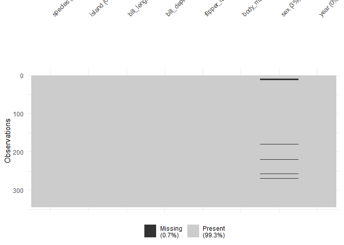<!-- -->

``` r
penguin_data %>% is.na() %>% colSums() %>% barplot() # plottting missing values in our dataset
```

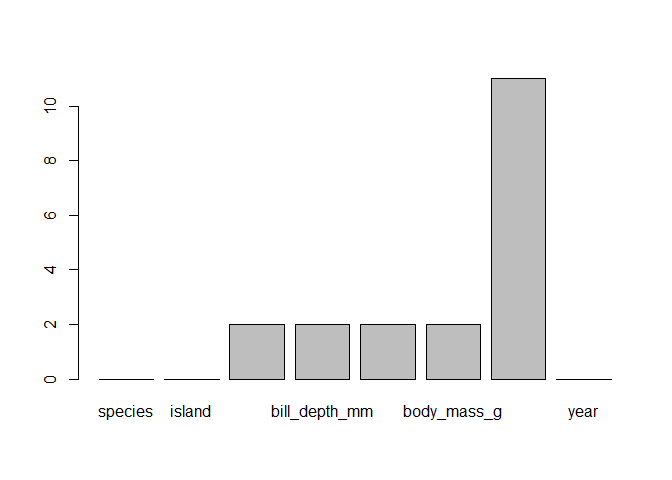<!-- -->

``` r
# 2. remove missing values rows in each column

penguin_data <- penguin_data %>% drop_na()

dim(penguin_data) # 11 rows with missing values are removed from our dataset
```

    ## [1] 333   8

``` r
penguin_data %>% is.na() %>% colSums() %>% barplot() # Now their is no missing values in each column
```

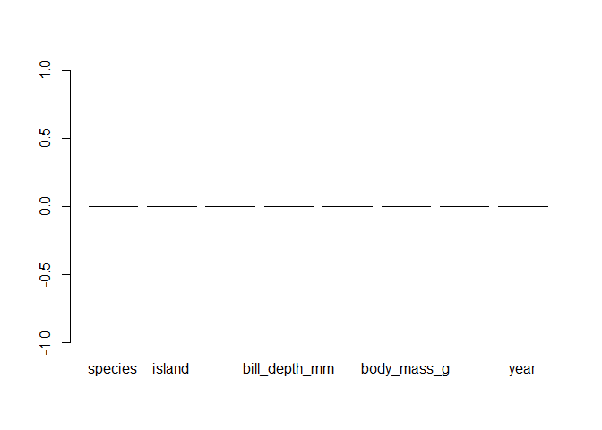<!-- -->

## **Step 08**

> Outlier Detection

``` r
# 1. Checking outliers by rstatix library

penguin_data %>% 
  select(where(is.numeric)) %>% 
  gather(variable, value) %>%
  group_by(variable) %>%
  identify_outliers(value)
```

    ## [1] variable   value      is.outlier is.extreme
    ## <0 rows> (or 0-length row.names)

``` r
# No outliers detected

# 2. Checking outliers by boxplot

pg <- penguin_data %>%  
  select(where(is.numeric)) %>% 
  select(-year) %>% 
  pivot_longer(everything(), names_to = "variable", values_to = "value") %>% 
  ggplot(aes(x = variable, y = value)) +
  geom_boxplot() +
  facet_wrap(~variable, scales = "free_y");pg
```

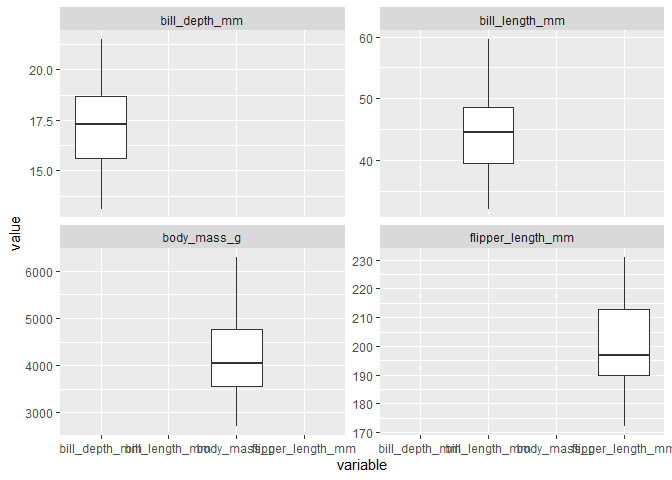<!-- -->

``` r
# No outliers detected
```

## **Step 09**

> Data transformation

If transformation is necessary we will do it, in our case we do for
body_mass variable

``` r
penguin_data1 <- penguin_data %>% 
  mutate(body_mass_kg = body_mass_g / 1000)
ncol(penguin_data1)
```

    ## [1] 9

``` r
summary(penguin_data1)
```

    ##       species          island    bill_length_mm  bill_depth_mm  
    ##  Adelie   :146   Biscoe   :163   Min.   :32.10   Min.   :13.10  
    ##  Chinstrap: 68   Dream    :123   1st Qu.:39.50   1st Qu.:15.60  
    ##  Gentoo   :119   Torgersen: 47   Median :44.50   Median :17.30  
    ##                                  Mean   :43.99   Mean   :17.16  
    ##                                  3rd Qu.:48.60   3rd Qu.:18.70  
    ##                                  Max.   :59.60   Max.   :21.50  
    ##  flipper_length_mm  body_mass_g       sex           year       body_mass_kg  
    ##  Min.   :172       Min.   :2700   female:165   Min.   :2007   Min.   :2.700  
    ##  1st Qu.:190       1st Qu.:3550   male  :168   1st Qu.:2007   1st Qu.:3.550  
    ##  Median :197       Median :4050                Median :2008   Median :4.050  
    ##  Mean   :201       Mean   :4207                Mean   :2008   Mean   :4.207  
    ##  3rd Qu.:213       3rd Qu.:4775                3rd Qu.:2009   3rd Qu.:4.775  
    ##  Max.   :231       Max.   :6300                Max.   :2009   Max.   :6.300

## **Step 10**

> Exploratory Data Analysis

Exploring patterns in our data

``` r
# 1. Histogram

ggplot(penguin_data, aes(body_mass_g)) +
   geom_density() ; ggplot(penguin_data, aes(flipper_length_mm)) +
   geom_density() ; ggplot(penguin_data, aes(bill_depth_mm)) +
   geom_density() ; ggplot(penguin_data, aes(bill_length_mm)) +
   geom_density()
```

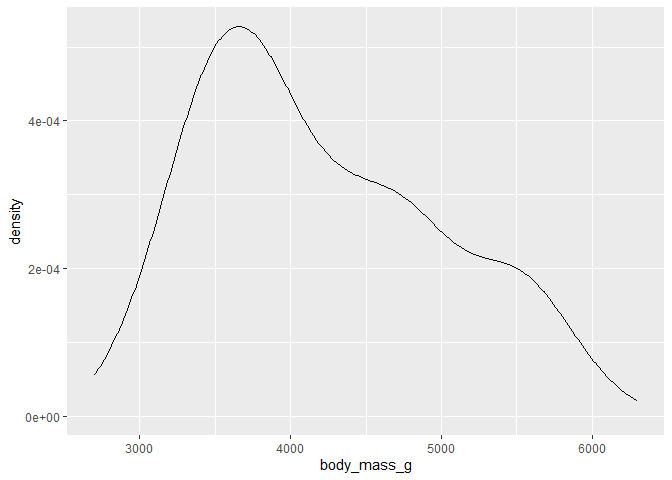<!-- -->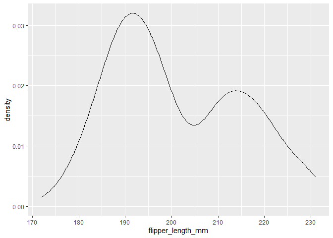<!-- -->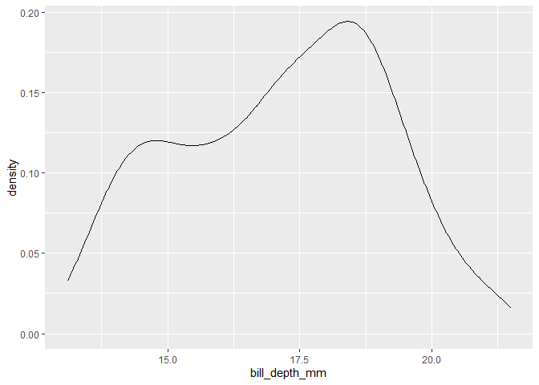<!-- -->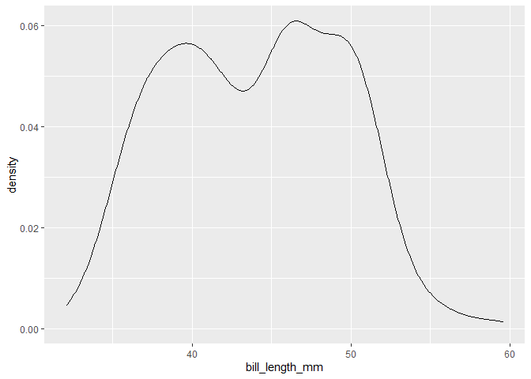<!-- -->

``` r
# 2. Boxplot

ggplot(penguin_data, aes(species, body_mass_g)) +
  geom_boxplot() ; ggplot(penguin_data, aes(species, flipper_length_mm)) +
  geom_boxplot() ; ggplot(penguin_data, aes(species, bill_length_mm)) +
  geom_boxplot() ; ggplot(penguin_data, aes(species, bill_depth_mm)) +
  geom_boxplot()
```

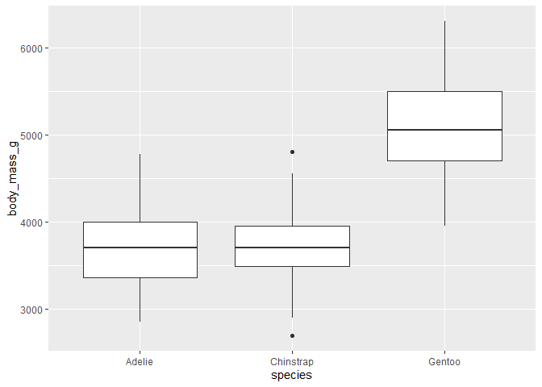<!-- -->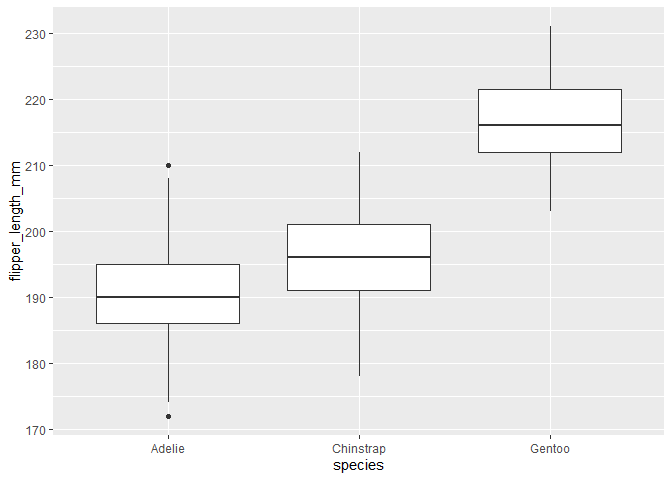<!-- -->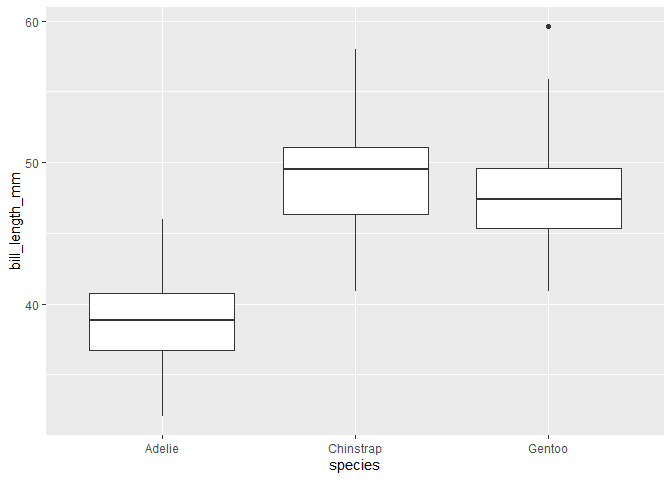<!-- -->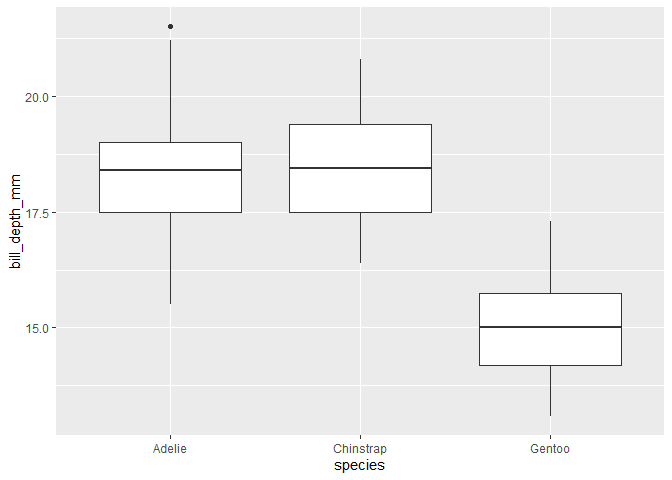<!-- -->

``` r
# 3. Correlation

ggpairs( penguin_data1, columns = c( "bill_length_mm","bill_depth_mm","flipper_length_mm","body_mass_kg"), 
         lower = list(continuous = wrap("points", alpha = 0.6, size = 2)),
         upper = list(continuous = wrap("cor", size = 5)),
         diag = list(continuous = wrap("densityDiag")))
```

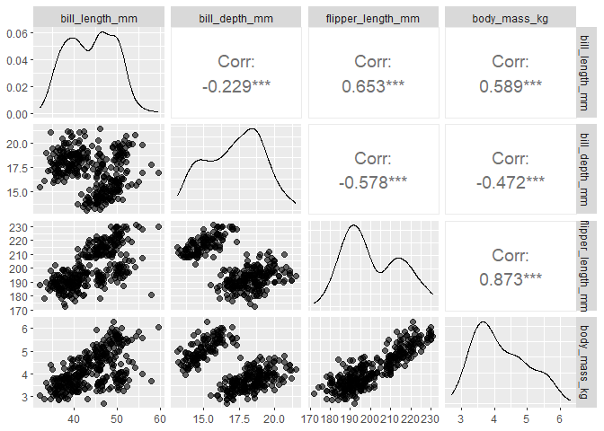<!-- -->

## **Step 10**

> Statistical test & Regression Analysis

Test body mass differences between species

``` r
 anova_model <- aov(body_mass_g ~ species, data = penguin_data)
 summary(anova_model)
```

    ##              Df    Sum Sq  Mean Sq F value Pr(>F)    
    ## species       2 145190219 72595110   341.9 <2e-16 ***
    ## Residuals   330  70069447   212332                   
    ## ---
    ## Signif. codes:  0 '***' 0.001 '**' 0.01 '*' 0.05 '.' 0.1 ' ' 1

``` r
# Conclusion
 
# Significant species differences
```

``` r
model <- lm(body_mass_g ~ flipper_length_mm, data = penguin_data)
 summary(model)
```

    ## 
    ## Call:
    ## lm(formula = body_mass_g ~ flipper_length_mm, data = penguin_data)
    ## 
    ## Residuals:
    ##      Min       1Q   Median       3Q      Max 
    ## -1057.33  -259.79   -12.24   242.97  1293.89 
    ## 
    ## Coefficients:
    ##                   Estimate Std. Error t value Pr(>|t|)    
    ## (Intercept)       -5872.09     310.29  -18.93   <2e-16 ***
    ## flipper_length_mm    50.15       1.54   32.56   <2e-16 ***
    ## ---
    ## Signif. codes:  0 '***' 0.001 '**' 0.01 '*' 0.05 '.' 0.1 ' ' 1
    ## 
    ## Residual standard error: 393.3 on 331 degrees of freedom
    ## Multiple R-squared:  0.7621, Adjusted R-squared:  0.7614 
    ## F-statistic:  1060 on 1 and 331 DF,  p-value: < 2.2e-16

``` r
# Conclusion
 
# Flipper length significantly predicts body mass. 
```

## **Step 11**

> Publication Ready Visualization

``` r
ggplot(penguin_data, aes(x = flipper_length_mm, y = body_mass_g, color = species)) +
  geom_point(size = 3) +
  geom_smooth(method = "lm") + 
  theme_classic()
```

    ## `geom_smooth()` using formula = 'y ~ x'

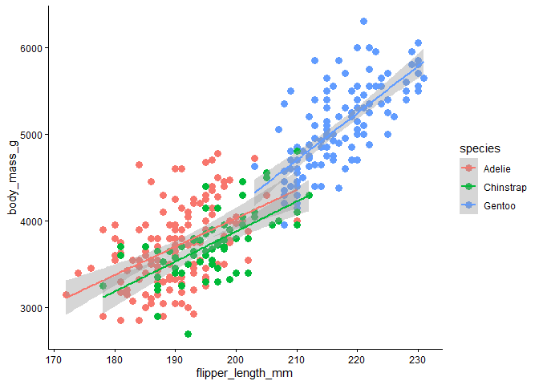<!-- -->

> Intepretation of Analysis

Penguin species differed significantly in body mass (ANOVA, p \< 0.001).
Gentoo penguins exhibited the highest body mass, whereas Adelie penguins
were the smallest. A strong positive association between flipper length
and body mass was also observed, suggesting that larger penguins possess
proportionally longer flippers

Best Regards,

Muhammad Yasir Qurashi

*Research Data Analysis Tools Mentor*
